# Architecture — Agentic Multi-Stage Bot

A comprehensive guide to the system design, data flows, deployment topology, and extension points of the Agentic AI monorepo.

---

## Table of Contents

- [Executive Summary](#executive-summary)
- [7-Layer Architecture](#7-layer-architecture)
- [System Topology](#system-topology)
- [Core Agent Graph (LangGraph)](#core-agent-graph-langgraph)
- [Request Lifecycle](#request-lifecycle)
- [Layer 1 — Experience](#layer-1--experience)
- [Layer 2 — Discovery](#layer-2--discovery)
- [Layer 3 — Agent Composition](#layer-3--agent-composition)
- [Layer 4 — Reasoning & Planning](#layer-4--reasoning--planning)
- [Layer 5 — Tools & API](#layer-5--tools--api)
- [Layer 6 — Memory & Feedback](#layer-6--memory--feedback)
- [Layer 7 — Infrastructure](#layer-7--infrastructure)
- [MCP Server (Control Plane)](#mcp-server-control-plane)
- [Sub-Pipelines](#sub-pipelines)
- [Social Media Automation](#social-media-automation)
- [Client SDKs](#client-sdks)
- [Data Model](#data-model)
- [Configuration](#configuration)
- [Deployment Architecture](#deployment-architecture)
- [Security Model](#security-model)
- [Extension Points](#extension-points)
- [Directory Map](#directory-map)

---

## Executive Summary

The **Agentic Multi-Stage Bot** is a production-grade, multi-stage agentic system that orchestrates LLM reasoning, autonomous tool use, and persistent memory through a **7-layer architecture**. The reference implementation is a **DossierOutreachAgent** — given a topic or company, it builds a cited briefing and optionally drafts an outreach email.

The monorepo also ships three companion pipelines (RAG, Coding, Data), a shared MCP control plane, client SDKs (Python, TypeScript, .NET 8), and enterprise deployment modules for AWS, GCP, Azure, OCI, Kubernetes, Nomad, and bare-metal.

---

## 7-Layer Architecture

Each layer has a single responsibility and communicates through well-defined interfaces.

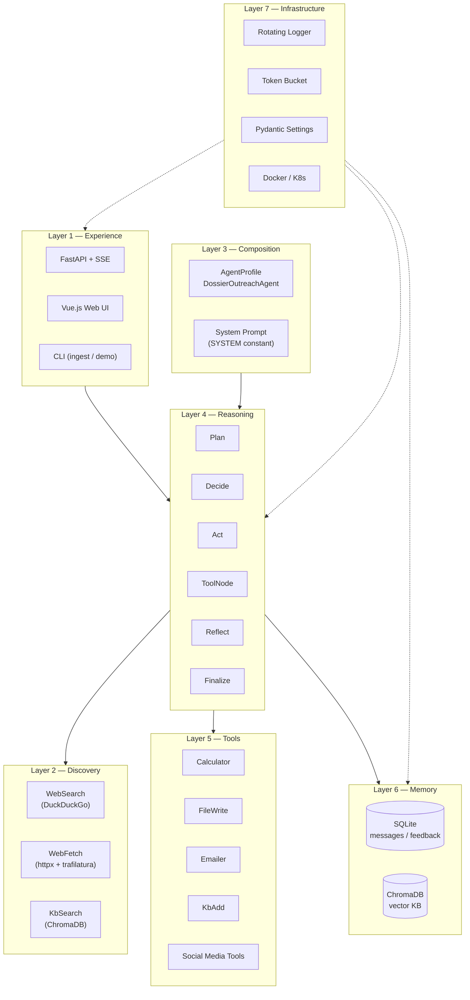

| Layer | Directory | Purpose |
|-------|-----------|---------|
| **1 — Experience** | `app.py`, `cli.py`, `web/` | HTTP API, SSE streaming, static UI, CLI |
| **2 — Discovery** | `tools/webtools.py`, `tools/knowledge.py` | Web search, URL extraction, KB semantic search |
| **3 — Composition** | `layers/composition.py` | Agent profile (persona, objective, capabilities) |
| **4 — Reasoning** | `layers/reasoning.py`, `graph.py` | LangGraph state machine, lazy graph init |
| **5 — Tools** | `tools/ops.py`, `layers/tools.py` | Tool registry, Calculator, FileWrite, Emailer |
| **6 — Memory** | `memory/sql_store.py`, `memory/vector_store.py` | SQLite conversations, ChromaDB vector store |
| **7 — Infra** | `infra/logging.py`, `infra/rate_limit.py`, `config.py` | Logging, rate limiting, env config, Docker |

---

## System Topology

The full monorepo connects multiple services, pipelines, and client SDKs:

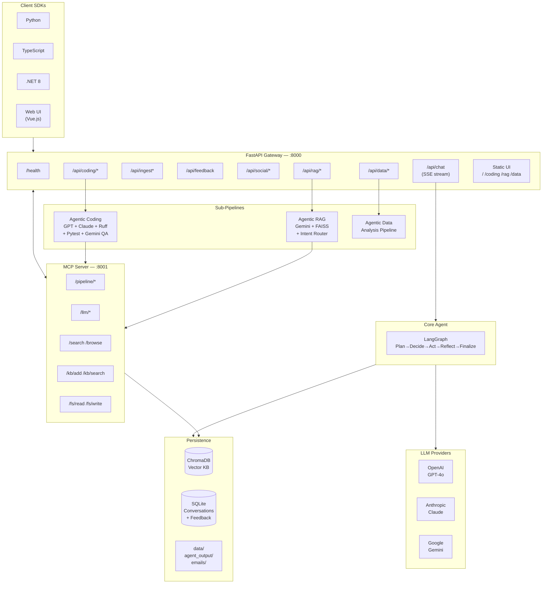

---

## Core Agent Graph (LangGraph)

The heart of the system is a typed state machine implemented with LangGraph. Every step is a single atomic action — no wall-of-text dumps.

### State Definition

```python
class AgentState(TypedDict):
    messages: list          # LangChain message objects
    plan: str               # Current action plan text
    next_action: str        # Token: search|fetch|kb_search|calculate|write_file|draft_email|finalize
    citations: list[str]    # Collected citation URLs
    done: bool              # Completion flag
```

### Graph Topology

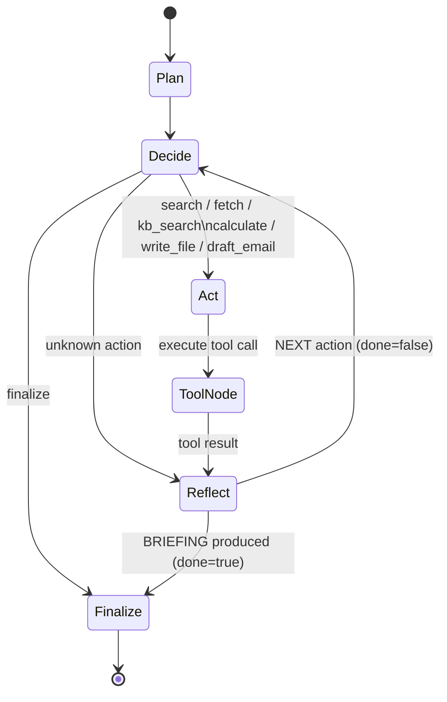

### Node Details

| Node | Function | LLM Call | Purpose |
|------|----------|----------|---------|
| **Plan** | `planner_node()` | Yes | Creates 3-6 step action plan with KB context (RAG pre-retrieval) |
| **Decide** | `decide_node()` | Yes | Selects ONE action token from: `search`, `fetch`, `kb_search`, `calculate`, `write_file`, `draft_email`, `finalize` |
| **Act** | `act_node_builder(tools)` | Yes (with tool binding) | Binds LLM to tool schemas, forces a single structured tool call |
| **ToolNode** | LangGraph `ToolNode(tools)` | No (execution only) | Executes the tool call and returns result |
| **Reflect** | `reflect_node()` | Yes | Produces `BRIEFING: ...` (final) or `NEXT:<action>` (continue) |
| **Finalize** | `finalize_node()` | No | Sets `done=True`, terminates graph |

### Edge Routing

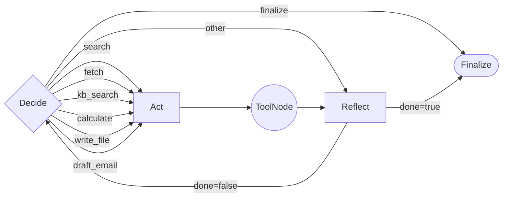

---

## Request Lifecycle

A complete chat request from the browser through the agent and back:

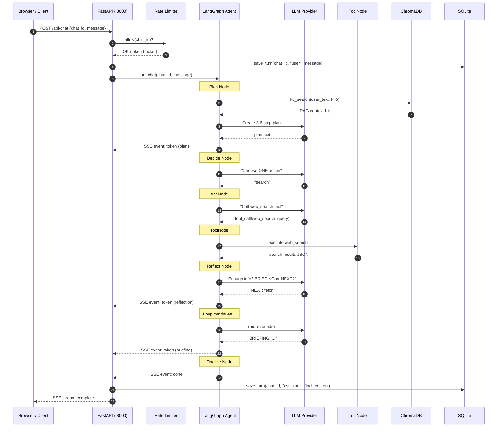

---

## Layer 1 — Experience

### FastAPI Application (`app.py`)

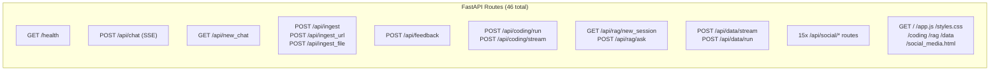

**Key design decisions:**

- **Lifespan context manager** replaces deprecated `@app.on_event("startup")` — initializes social media services with non-fatal fallback
- **Lazy sub-pipeline imports** — Coding, RAG, Data pipelines are imported on first request via `_import_*_services()` helpers (avoids startup failures if sub-pipelines are missing)
- **Static file serving** — resolves from `web/` directory relative to project root, not `src/`
- **SSE streaming** via `sse-starlette` — each token streams immediately, `done` event signals completion

### Web UI

Zero-build SPA using Vue 3 + Marked.js via CDN. Files: `web/index.html`, `web/app.js`, `web/styles.css`.

### CLI (`cli.py`)

Two commands:
- `agentic-ai ingest <dir>` — walks directory, ingests `.txt`/`.md` files into ChromaDB
- `agentic-ai demo <prompt>` — runs a prompt through the HTTP API and streams to stdout

---

## Layer 2 — Discovery

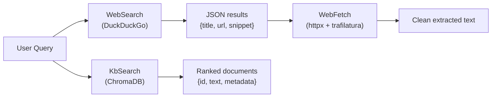

| Tool | Class | Backend | Retry |
|------|-------|---------|-------|
| `web_search` | `WebSearch(BaseTool)` | `duckduckgo-search` (DDGS) | 3x exponential backoff |
| `web_fetch` | `WebFetch(BaseTool)` | `httpx` + `trafilatura` extraction | 3x exponential backoff |
| `kb_search` | `KbSearch(BaseTool)` | ChromaDB `collection.query()` | None |
| `kb_add` | `KbAdd(BaseTool)` | ChromaDB `collection.add()` | None |

---

## Layer 3 — Agent Composition

```python
PROFILE = AgentProfile(
    name="DossierOutreachAgent",
    persona="Calm, analytical research strategist that plans first, cites sources, "
            "writes crisp briefings, and drafts professional outreach emails on request.",
    objective="Produce competitive/company/topic briefings with concrete facts and citations. "
              "When asked, draft an outreach email and save artifacts to disk.",
    capabilities=["plan", "search", "fetch", "kb_search", "summarize",
                   "calculate", "write_file", "email", "memory"]
)
```

The profile feeds into the `SYSTEM` prompt constant in `reasoning.py`, shaping all LLM interactions.

---

## Layer 4 — Reasoning & Planning

### LLM Factory

```python
def _llm():
    if settings.MODEL_PROVIDER == "anthropic":
        return ChatAnthropic(model=settings.ANTHROPIC_MODEL_CHAT, temperature=0.2)
    return ChatOpenAI(model=settings.OPENAI_MODEL_CHAT, temperature=0.2)
```

### Lazy Graph Initialization (`graph.py`)

The graph is built on first request (not at import time) to avoid API-key validation at startup:

```python
_graph = None

def _get_graph():
    global _graph
    if _graph is None:
        _tools = registry()
        _graph = build_graph(_tools)
    return _graph
```

---

## Layer 5 — Tools & API

### Tool Registry

```python
def registry() -> List[BaseTool]:
    return [
        WebSearch(), WebFetch(), KbSearch(), KbAdd(),
        Calculator(), FileWrite(), Emailer()
    ]
```

### Tool Specifications

| Tool | Name | Input | Output | Side Effects |
|------|------|-------|--------|-------------|
| `Calculator` | `calculator` | Math expression string | Result string | None |
| `FileWrite` | `file_write` | `{path, content}` JSON | Absolute file path | Writes to `data/agent_output/` |
| `Emailer` | `emailer` | `{to, subject, body}` JSON | `.eml` file path | Writes to `data/emails/` |
| `WebSearch` | `web_search` | NL query | JSON list of results | Network call (DuckDuckGo) |
| `WebFetch` | `web_fetch` | URL string | Extracted text | Network call (target URL) |
| `KbSearch` | `kb_search` | NL query | JSON list of {id, text, metadata} | ChromaDB read |
| `KbAdd` | `kb_add` | `{id, text, metadata}` JSON | `"ok"` | ChromaDB write |

All tools extend `langchain.tools.BaseTool` with type-annotated `name: str` and `description: str` (required by Pydantic v2).

---

## Layer 6 — Memory & Feedback

### Dual Memory Architecture

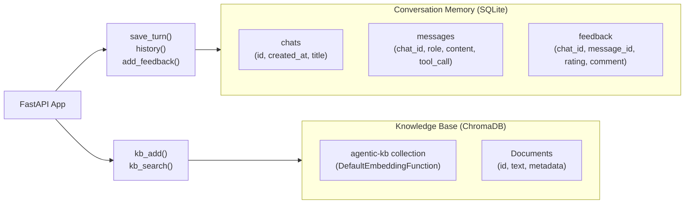

### Memory Facade (`layers/memory.py`)

```python
sql = SQLStore(sqlite_path=settings.SQLITE_PATH)
vs  = VectorStore(persist_dir=settings.CHROMA_DIR)

def save_turn(chat_id, role, content, tool_call=None): ...
def history(chat_id) -> list[dict]: ...
def add_feedback(chat_id, message_id, rating, comment): ...
def kb_add(doc_id, text, metadata=None): ...
def kb_search(query, k=5) -> list[dict]: ...
```

### SQLite Schema

```sql
CREATE TABLE chats (
    id TEXT PRIMARY KEY,
    created_at TIMESTAMP DEFAULT CURRENT_TIMESTAMP,
    title TEXT
);

CREATE TABLE messages (
    id INTEGER PRIMARY KEY AUTOINCREMENT,
    chat_id TEXT,
    role TEXT,          -- 'user' | 'assistant'
    content TEXT,
    tool_call TEXT,     -- optional: serialized tool call
    created_at TIMESTAMP DEFAULT CURRENT_TIMESTAMP
);

CREATE TABLE feedback (
    id INTEGER PRIMARY KEY AUTOINCREMENT,
    chat_id TEXT,
    message_id INTEGER,
    rating INTEGER,
    comment TEXT,
    created_at TIMESTAMP DEFAULT CURRENT_TIMESTAMP
);
```

### ChromaDB Vector Store

- **Collection**: `agentic-kb`
- **Embedding**: `DefaultEmbeddingFunction()` (ONNX MiniLM-L6-v2, runs locally)
- **Persistence**: `PersistentClient(path=settings.CHROMA_DIR)`
- **Non-empty metadata enforced**: empty `{}` gets default `{"source": "api"}`

---

## Layer 7 — Infrastructure

### Logging

Rotating file handler (`5MB` max, 2 backups) + console handler. Output format:
```
2026-03-21 14:00:00 | INFO | agentic-ai | message
```

### Rate Limiting

Token-bucket algorithm per `chat_id`: 5 tokens, refills every 10 seconds. Returns `429` when exhausted.

### Configuration (`config.py`)

```python
class Settings(BaseSettings):
    MODEL_PROVIDER: Literal["openai", "anthropic"] = "openai"
    OPENAI_API_KEY: str = ""
    OPENAI_MODEL_CHAT: str = "gpt-4o-mini"
    OPENAI_MODEL_EMBED: str = "text-embedding-3-small"
    ANTHROPIC_API_KEY: str = ""
    ANTHROPIC_MODEL_CHAT: str = "claude-3-5-sonnet-latest"
    GOOGLE_API_KEY: str = ""
    CHROMA_DIR: str = ".chroma"
    SQLITE_PATH: str = ".sqlite/agent.db"
    APP_HOST: str = "0.0.0.0"
    APP_PORT: int = 8000
    LOG_LEVEL: str = "INFO"
    LOG_DIR: str = ".logs"
```

Loaded from `.env` via Pydantic Settings. Docker overrides via `environment:` in compose.yaml.

---

## MCP Server (Control Plane)

The MCP server unifies all pipelines and shared tooling behind a single HTTP API on port **8001**.

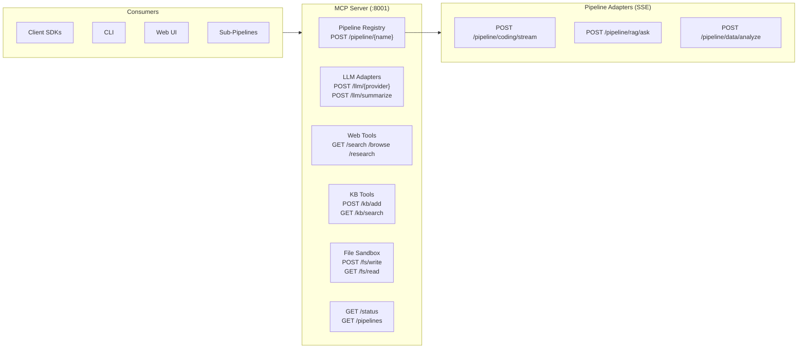

### LLM Client Abstraction

Three lightweight HTTP clients (`clients.py`) — no SDK dependencies:

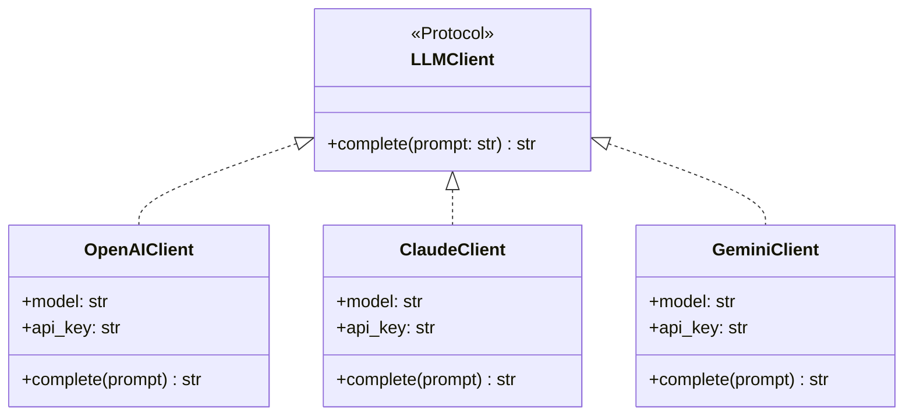

---

## Sub-Pipelines

### Agentic Coding Pipeline

**Location**: `Agentic-Coding-Pipeline/`

A multi-LLM pair-programming system that generates code, formats it, writes tests, runs them, and passes QA review — all autonomously with iterative retry.

#### Orchestration Flow

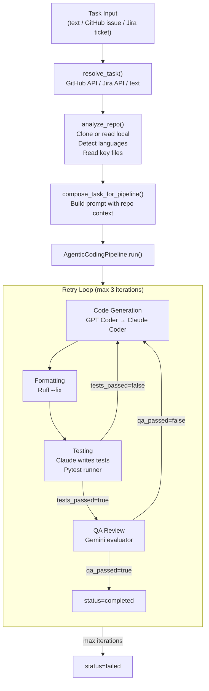

#### Agent Classes

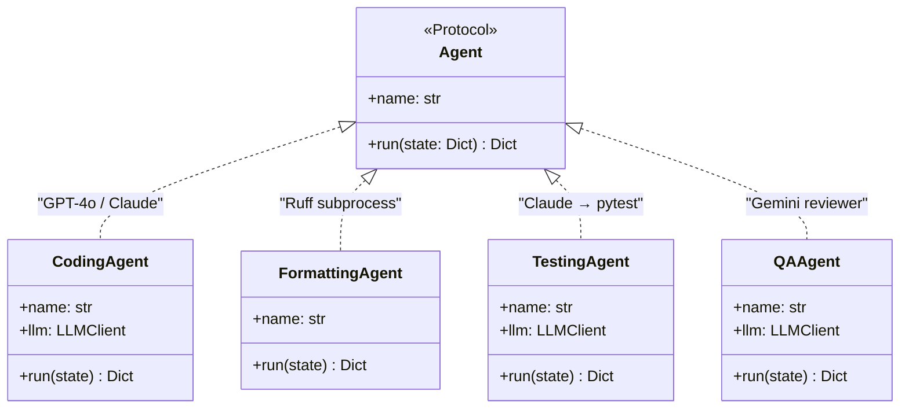

| Agent | LLM | Purpose | Input | Output |
|-------|-----|---------|-------|--------|
| `CodingAgent("gpt-coder")` | OpenAI GPT-4o | Generate/improve code | `task`, `proposed_code?` | `proposed_code` |
| `CodingAgent("claude-coder")` | Claude | Generate/improve code | `task`, `proposed_code?` | `proposed_code` |
| `FormattingAgent("formatter")` | None (subprocess) | Ruff `--fix` formatting | `proposed_code` | `proposed_code` (formatted) |
| `TestingAgent("tester")` | Claude | Write + run pytest | `proposed_code` | `tests_passed`, `test_output` |
| `QAAgent("qa")` | Gemini | Code review: PASS/FAIL | `proposed_code` | `qa_passed`, `qa_output` |

#### Pipeline State

| Key | Type | Description |
|-----|------|-------------|
| `task` | `str` | The original task prompt (enriched with repo context) |
| `proposed_code` | `str` | Current code solution (mutated by each agent) |
| `status` | `str` | `"completed"` or `"failed"` |
| `reason` | `str` | Failure reason (if failed) |
| `feedback` | `str` | Accumulated test/QA feedback for retry |
| `tests_passed` | `bool` | Whether pytest passed |
| `test_output` | `str` | Full pytest stdout+stderr |
| `qa_passed` | `bool` | Whether Gemini QA approved |
| `qa_output` | `str` | QA review text |

#### Task Resolution

The pipeline resolves tasks from multiple sources in priority order:

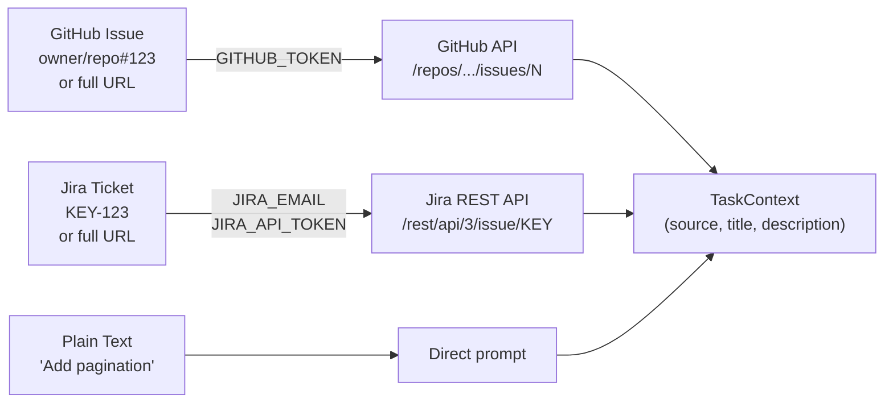

#### Streaming API

```
POST /api/coding/stream → SSE events:
  event: log    data: "Analyzing repo..."
  event: log    data: "GPT coder generating..."
  event: log    data: "Formatting with Ruff..."
  event: log    data: "Running pytest..."
  event: log    data: "Gemini QA reviewing..."
  event: done   data: {"status":"completed","task":{...},"proposed_code":"..."}
```

---

### Agentic RAG Pipeline

**Location**: `Agentic-RAG-Pipeline/`

A multi-agent retrieval-augmented generation system built on Google Gemini with FAISS vector search, intent classification, query decomposition, dual retrieval (vector + web), iterative critique, and guardrails.

#### Orchestration Flow

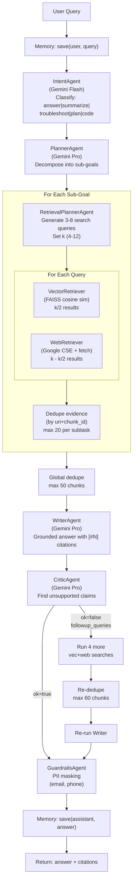

#### Agent Details

| Agent | Model | Temperature | Max Tokens | Purpose |
|-------|-------|-------------|------------|---------|
| `IntentAgent` | Gemini Flash | 0.1 | 256 | Classify intent, urgency, safety flags |
| `PlannerAgent` | Gemini Pro | 0.2 | 512 | Decompose into ordered sub-goals |
| `RetrievalPlannerAgent` | Gemini Pro | 0.2 | 256 | Generate 3-8 diverse search queries |
| `VectorRetriever` | — (FAISS) | — | — | Cosine similarity on 768-d embeddings |
| `WebRetriever` | — (Google CSE) | — | — | Search + fetch + extract (2000 chars) |
| `WriterAgent` | Gemini Pro | 0.2 | 1200 | Grounded answer with `[#N]` citations |
| `CriticAgent` | Gemini Pro | 0.1 | 512 | Find unsupported claims, suggest follow-ups |
| `GuardrailsAgent` | — (regex) | — | — | Mask PII (emails → `[redacted-email]`, phones → `[redacted-phone]`) |

#### RAG State / Evidence Model

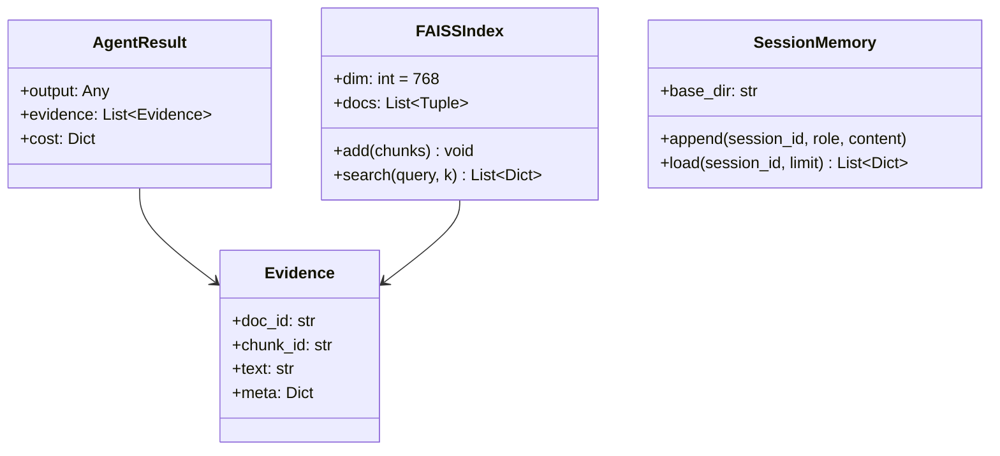

#### Intent Classification Output

```json
{
  "intents": ["answer"],
  "safety": [],
  "urgency": "low",
  "notes": "factual question about technology"
}
```

Possible intents: `answer`, `summarize`, `troubleshoot`, `plan`, `code`, `search_only`, `tool_only`

#### Streaming API

```
POST /api/rag/ask → SSE events:
  event: log      data: "Classifying intent..."
  event: log      data: "Planning retrieval..."
  event: log      data: "Retrieving 12 chunks..."
  event: log      data: "Writing grounded answer..."
  event: answer   data: "The answer is... [#1] [#2]..."
  event: sources  data: [{"doc_id":"...","text":"...","meta":{}}]
  event: done     data: {"session_id":"...","chunks":12}
```

#### FAISS Vector Store

- **Embedding model**: `text-embedding-004` (768 dimensions)
- **Index type**: `IndexFlatIP` (inner product on unit vectors = cosine similarity)
- **Ingestion**: Recursive file walker → char-based chunking (1200 chars, 200 overlap) → embed → normalize → add
- **Query**: Embed query with `retrieval_query` task type → normalize → search top-k

---

### Agentic Data Pipeline

**Location**: Referenced in `app.py` as `Agentic-Data-Pipeline/` (lazy import).

Exposed via:
- `POST /api/data/stream` — SSE streaming analysis
- `POST /api/data/run` — synchronous analysis returning final report

State: `source` (text/csv/url), `dataset` (content), `task` (analysis goal).

---

## Social Media Automation

**Location**: `src/agentic_ai/social_media_api.py`, `social_media_scheduler.py`, `agents/social_media_agent.py`, `tools/social_media_tools.py`, `tools/content_generation.py`

Integrated directly into the FastAPI app at `/api/social/*` with **15 endpoints**.

#### Architecture

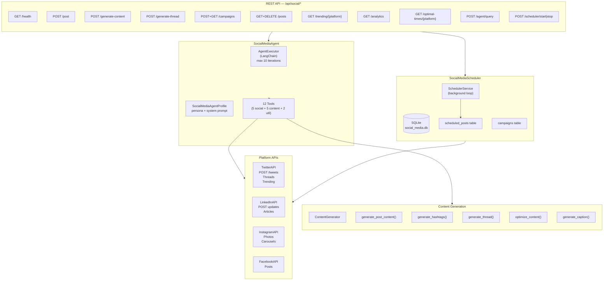

#### Tool Registry (12 Tools)

| # | Tool | Type | Input |
|---|------|------|-------|
| 1 | `social_media_post` | Platform | `{platform, content, media_urls?, hashtags?}` |
| 2 | `social_media_thread` | Platform | `{tweets: ["...", "..."]}` |
| 3 | `social_media_trending` | Platform | platform name |
| 4 | `social_media_search` | Platform | `{platform, query, max_results?}` |
| 5 | `social_media_analytics` | Platform | `{platform, post_id?}` |
| 6 | `generate_social_content` | Content | `{topic, platform, tone?, max_length?}` |
| 7 | `generate_hashtags` | Content | `{content, platform, count?}` |
| 8 | `generate_twitter_thread` | Content | `{topic, num_tweets?, tone?}` |
| 9 | `optimize_social_content` | Content | `{content, platform, goal?}` |
| 10 | `generate_image_caption` | Content | `{image_description, platform, tone?}` |

Platform character limits enforced: Twitter 280, LinkedIn 3000, Instagram 2200, Facebook 63206.

#### Campaign Creation Flow

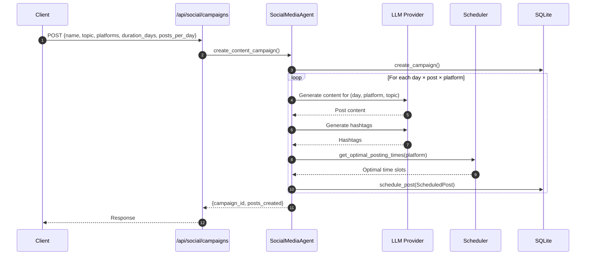

#### Scheduler Database Schema

```sql
CREATE TABLE campaigns (
    id TEXT PRIMARY KEY,
    name TEXT, description TEXT,
    platforms TEXT,              -- JSON array
    start_date TEXT, end_date TEXT,
    status TEXT DEFAULT 'draft', -- active|paused|completed|draft
    budget REAL, target_audience TEXT,
    goals TEXT,                  -- JSON array
    created_at TEXT, metadata TEXT
);

CREATE TABLE scheduled_posts (
    id TEXT PRIMARY KEY,
    platform TEXT, content TEXT,
    media_urls TEXT,             -- JSON array
    hashtags TEXT,               -- JSON array
    scheduled_time TEXT,
    status TEXT DEFAULT 'scheduled', -- draft|scheduled|published|failed|cancelled
    campaign_id TEXT, created_at TEXT,
    published_at TEXT, error_message TEXT,
    metadata TEXT
);

CREATE INDEX idx_posts_scheduled_time ON scheduled_posts(scheduled_time);
CREATE INDEX idx_posts_status ON scheduled_posts(status);
CREATE INDEX idx_posts_campaign ON scheduled_posts(campaign_id);
```

#### Background Scheduler Service

The `SchedulerService` runs as a background async loop:
1. Every 60 seconds, query posts due within 5 minutes
2. For each post, call the platform API (Twitter/LinkedIn/Instagram/Facebook)
3. On success: update status to `published`, set `published_at`
4. On failure: update status to `failed`, store `error_message`

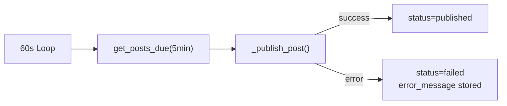

---

## Cross-Pipeline Integration

All pipelines share infrastructure through the MCP server and common data layer:

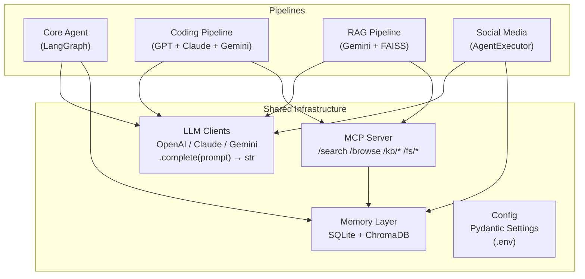

### State Key Summary (All Pipelines)

| Pipeline | Key | Type | Description |
|----------|-----|------|-------------|
| **Core** | `messages` | `list` | LangChain message history |
| | `plan` | `str` | Current action plan |
| | `next_action` | `str` | `search\|fetch\|kb_search\|calculate\|write_file\|draft_email\|finalize` |
| | `citations` | `list[str]` | Collected URLs |
| | `done` | `bool` | Completion flag |
| **Coding** | `task` | `str` | Task prompt (with repo context) |
| | `proposed_code` | `str` | Current code solution |
| | `status` | `str` | `completed\|failed` |
| | `tests_passed` | `bool` | Pytest result |
| | `test_output` | `str` | Pytest stdout+stderr |
| | `qa_passed` | `bool` | Gemini QA verdict |
| | `qa_output` | `str` | QA review text |
| | `feedback` | `str` | Error feedback for retry |
| **RAG** | `intents` | `list[str]` | `answer\|summarize\|troubleshoot\|plan\|code` |
| | `urgency` | `str` | `low\|medium\|high` |
| | `plan` | `list[dict]` | Ordered sub-goals with `{id, goal, sources, done_test}` |
| | `queries` | `list[str]` | 3-8 diverse search queries per sub-goal |
| | `evidence` | `list[Evidence]` | Deduped chunks (max 50 global) |
| | `draft` | `str` | Writer output with `[#N]` citations |
| | `ok` | `bool` | Critic verdict |
| | `followup_queries` | `list[str]` | Critic-suggested additional searches |
| **Social** | `platform` | `str` | `twitter\|linkedin\|instagram\|facebook` |
| | `content` | `str` | Post content |
| | `status` | `PostStatus` | `draft\|scheduled\|published\|failed\|cancelled` |
| | `campaign_id` | `str` | Parent campaign reference |
| | `hashtags` | `list[str]` | Generated tags |
| | `scheduled_time` | `datetime` | When to publish |

### Error Handling Pattern

All pipelines follow the same pattern:
1. **Agent-level**: exceptions caught, error stored in state (`qa_output`, `error_message`, etc.)
2. **Service-level**: SSE stream yields `("log", error_msg)` then `("done", {"status":"failed"})`
3. **API-level**: `HTTPException` with appropriate status code (400/429/500/503)
4. **Non-fatal init**: social media, sub-pipelines gracefully degrade if missing (logged as warning)

---

## Client SDKs

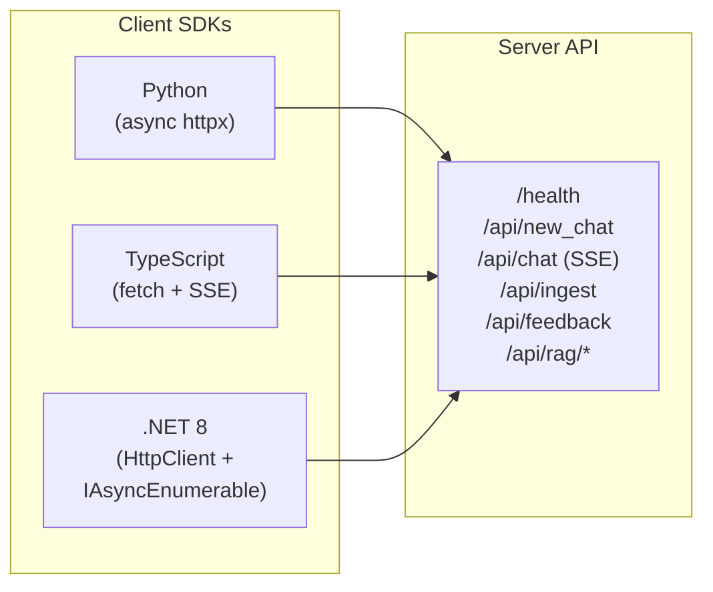

| SDK | Location | SSE Support | Auth Pattern |
|-----|----------|-------------|-------------|
| **Python** | `clients/python/` | `async for` with httpx | Header injection |
| **TypeScript** | `clients/ts/` | EventSource / fetch | Constructor config |
| **.NET 8** | `clients/dotnet/` | `IAsyncEnumerable<SseEvent>` | `IHttpClientFactory` + DI |

---

## Data Model

### Entity Relationships

```mermaid
erDiagram
    CHAT ||--o{ MESSAGE : contains
    CHAT ||--o{ FEEDBACK : receives
    MESSAGE ||--o| FEEDBACK : "rated by"
    KB_DOCUMENT ||--o{ KB_METADATA : has

    CHAT {
        text id PK
        timestamp created_at
        text title
    }
    MESSAGE {
        int id PK
        text chat_id FK
        text role
        text content
        text tool_call
        timestamp created_at
    }
    FEEDBACK {
        int id PK
        text chat_id FK
        int message_id FK
        int rating
        text comment
        timestamp created_at
    }
    KB_DOCUMENT {
        text id PK
        text content
        vector embedding
    }
    KB_METADATA {
        text doc_id FK
        text key
        text value
    }
```

---

## Configuration

### Environment Variables

```mermaid
flowchart LR
    ENV[".env file"] --> PS["Pydantic Settings"]
    DOCKER["Docker env_file\n+ environment:"] --> PS
    CLI_ENV["CLI env vars"] --> PS
    PS --> APP["FastAPI App"]
    PS --> MCP_S["MCP Server"]
    PS --> GRAPH_S["LangGraph Agent"]
```

| Variable | Default | Used By |
|----------|---------|---------|
| `MODEL_PROVIDER` | `openai` | Reasoning layer |
| `OPENAI_API_KEY` | `""` | LLM calls |
| `ANTHROPIC_API_KEY` | `""` | LLM calls |
| `GOOGLE_API_KEY` | `""` | MCP Gemini adapter |
| `CHROMA_DIR` | `.chroma` | Vector store |
| `SQLITE_PATH` | `.sqlite/agent.db` | Conversation store |
| `APP_HOST` | `0.0.0.0` | Uvicorn bind |
| `APP_PORT` | `8000` | Uvicorn port |
| `LOG_LEVEL` | `INFO` | Logger |
| `LOG_DIR` | `.logs` | Log file directory |

---

## Deployment Architecture

### Multi-Cloud Support

```mermaid
flowchart TB
    subgraph TF["Terraform Root"]
        VAR["cloud_provider = ?"]
    end

    VAR -->|aws| AWS["AWS\nECS Fargate\nALB + CodeDeploy\nECR"]
    VAR -->|gcp| GCP["GCP\nCloud Run v2\nArtifact Registry\nCloud SQL\nCloud Armor WAF"]
    VAR -->|azure| AZ["Azure\nContainer Apps\nACR\nVNet + NSG\nLog Analytics"]
    VAR -->|oci| OCI["OCI\nContainer Instances\nOCIR\nVCN + LB"]

    subgraph K8S["Kubernetes (any cloud)"]
        STD["Standard\nDeployment"]
        BG["Blue/Green\n2 Deployments\nService switch"]
        CAN["Canary\nFlagger\nProgressive delivery"]
        SEC["Security\nNetworkPolicy\nPod Security Standards"]
    end

    subgraph ONPREM["On-Premises"]
        NOMAD_D["HashiCorp Nomad\nVault secrets\nCanary updates"]
        ANSIBLE_D["Ansible\nSystemd / Docker\nNGINX reverse proxy"]
        COMPOSE_D["Docker Compose\nApp + MCP\nVolume persistence"]
    end

    subgraph GITOPS["GitOps"]
        ARGO["ArgoCD\nSync windows\nRollout strategy"]
        FLUX["Flux v2\nImage automation\nSlack notifications"]
    end
```

### Docker Architecture

```mermaid
flowchart LR
    subgraph Build["Multi-Stage Dockerfile"]
        BUILDER["Stage 1: builder\npython:3.11-slim\nbuild-essential\npip install"]
        RUNTIME["Stage 2: runtime\npython:3.11-slim\nlibxml2 + curl\nNon-root: appuser"]
        BUILDER --> RUNTIME
    end

    subgraph Compose["Docker Compose"]
        APP_SVC["app (:8000)\n2G / 2 CPU\n/health check"]
        MCP_SVC["mcp (:8001)\n1G / 1 CPU\n/status check"]
        APP_SVC --> CHROMA_VOL[("chroma-data")]
        APP_SVC --> SQLITE_VOL[("sqlite-data")]
        MCP_SVC --> CHROMA_VOL
        MCP_SVC --> SQLITE_VOL
    end
```

### Terraform Module Matrix

| Module | Lines | Resources |
|--------|-------|-----------|
| `ecs_fargate` | 109 | ECR, ECS Cluster, Task Def, ALB, IAM |
| `ecs_blue_green` | 356 | Dual TGs, CodeDeploy, Test Listener |
| `ecs_canary` | 260 | Weighted TGs, Dual Services |
| `gcp_cloud_run` | 1,240 | Cloud Run v2, Artifact Registry, Secret Manager, Cloud SQL, VPC Connector, HTTPS LB, Cloud Armor WAF |
| `azure_container_apps` | 864 | Container Apps, ACR, VNet, NSG, Log Analytics |
| `oci_container_instances` | 1,233 | Container Instances, OCIR, VCN, NAT/IGW, LB |

---

## Security Model

```mermaid
flowchart TB
    subgraph Perimeter["Perimeter"]
        RL_SEC["Rate Limiting\n(token bucket per chat_id)"]
        CORS["CORS / Security Headers\n(via reverse proxy)"]
        TLS["TLS Termination\n(Caddy / NGINX / Cloud LB)"]
    end

    subgraph App["Application"]
        SECRETS["Pydantic Settings\n(.env never committed)"]
        SANDBOX["File Sandbox\n(data/agent_output/ only)"]
        CALC_SAFE["Calculator\n(no builtins, math only)"]
        NONROOT["Non-root Docker\n(appuser:1001)"]
    end

    subgraph Infra["Infrastructure"]
        VAULT_SEC["HashiCorp Vault\nKV + DB + PKI + Transit"]
        NETPOL["K8s NetworkPolicy\n(ingress/egress restricted)"]
        PODSEC["Pod Security Standards\n(restricted enforcement)"]
        IAM["Cloud IAM\n(least-privilege SA)"]
    end

    subgraph CI["CI/CD"]
        CODEQL["CodeQL\n(security scanning)"]
        AUDIT["pip-audit\n(dependency vulnerabilities)"]
        RUFF_SEC["Ruff\n(code quality)"]
    end

    Perimeter --> App
    App --> Infra
    CI -.-> App
```

---

## Extension Points

### Add a New Tool

1. Create `src/agentic_ai/tools/my_tool.py`:
   ```python
   class MyTool(BaseTool):
       name: str = "my_tool"
       description: str = "What it does. Input: X. Output: Y."
       def _run(self, input: str) -> str: ...
   ```
2. Register in `layers/tools.py::registry()`.
3. Add action token to `decide_node()` prompt and `act_node()` mapping.

### Add a New LLM Provider

1. Add client in `llm/clients.py` implementing `LLMClient` protocol.
2. Add provider branch in `layers/reasoning.py::_llm()`.
3. Add env vars in `config.py::Settings`.

### Add a New Sub-Pipeline

1. Create directory with `services.py` exporting a stream function.
2. Add lazy import in `app.py` following the `_import_*_services()` pattern.
3. Add SSE endpoint adapter in `mcp/server.py`.

### Change the Agent Profile

Edit `layers/composition.py::PROFILE` — persona, objective, and capabilities shape all LLM interactions via the `SYSTEM` prompt.

---

## Directory Map

```
src/agentic_ai/
├── app.py                    # FastAPI gateway (46 routes, lifespan, SSE)
├── graph.py                  # Lazy LangGraph runner
├── cli.py                    # CLI: ingest + demo
├── config.py                 # Pydantic Settings
├── layers/
│   ├── composition.py        # AgentProfile (DossierOutreachAgent)
│   ├── reasoning.py          # LangGraph state machine (6 nodes)
│   ├── memory.py             # Memory facade (SQL + Vector)
│   └── tools.py              # Tool registry (7 tools)
├── tools/
│   ├── webtools.py           # WebSearch, WebFetch
│   ├── ops.py                # Calculator, FileWrite, Emailer
│   ├── knowledge.py          # KbSearch, KbAdd
│   ├── social_media_tools.py # Social platform tools
│   └── content_generation.py # AI content generation
├── memory/
│   ├── sql_store.py          # SQLite (chats, messages, feedback)
│   └── vector_store.py       # ChromaDB (agentic-kb collection)
├── llm/
│   ├── clients.py            # OpenAI, Claude, Gemini HTTP clients
│   └── client.py             # LangChain ChatModel factory
├── infra/
│   ├── logging.py            # Rotating file + console logger
│   └── rate_limit.py         # Token-bucket rate limiter
├── agents/
│   └── social_media_agent.py # Social media AgentExecutor
├── social_media_api.py       # /api/social/* router (15 endpoints)
└── social_media_scheduler.py # Campaign scheduler (SQLite-backed)

mcp/
├── server.py                 # MCP FastAPI app (pipeline dispatch + tools)
├── schemas.py                # Pydantic request models
└── tools/
    ├── web.py                # search_ddg(), fetch_page()
    ├── kb.py                 # kb_add(), kb_search()
    └── files.py              # sandboxed read/write

clients/
├── python/                   # Async Python client SDK
├── ts/                       # TypeScript/Node client SDK
└── dotnet/                   # .NET 8 client SDK (C#)

hashicorp/terraform/
├── main.tf                   # Multi-provider root (cloud_provider var)
├── modules/
│   ├── ecs_fargate/          # AWS ECS Fargate
│   ├── ecs_blue_green/       # AWS ECS + CodeDeploy
│   ├── ecs_canary/           # AWS ECS weighted routing
│   ├── gcp_cloud_run/        # GCP Cloud Run v2
│   ├── azure_container_apps/ # Azure Container Apps
│   └── oci_container_instances/ # OCI Container Instances
├── vault/                    # Vault policy (KV, DB, PKI, Transit)
└── nomad/                    # Nomad job (dual groups, Vault integration)

k8s/
├── deployment.yaml           # Standard deployment
├── service.yaml / ingress.yaml
├── blue-green/               # Blue/green manifests
├── canary/                   # Canary + Flagger + HPA
├── network-policy.yaml       # Ingress/egress restrictions
└── pod-security.yaml         # Namespace + quotas + SA

gitops/
├── argocd/                   # Applications + Rollouts + AppProject
└── flux/                     # Sync + Image automation + Notifications
```

---

*Last updated: 2026-03-21 — v0.4.0*
