# Agentic Coding Pipeline (with Multi-LLM Pair Programming)

An end-to-end, production-ready **agentic coding** loop that continuously drafts, formats, tests, and reviews code until quality gates pass.
It orchestrates **specialized LLM agents**, **local developer tooling**, and **git-friendly utilities** so you can ship reliable patches on autopilot.

Paste in your task (Jira, GitHub, or free text) and a repository (URL or local path), and watch GPT and Claude coders collaborate to deliver a ready-to-commit patch!

[](#)
[](#)
[](#)
[](#)
[](#)
[](#)
[](#)
[](#)
[](#)
[](#)
[](#)
[](#)
[](#)
[](#)

---

## Contents

* [What you get](#what-you-get)
* [Architecture](#architecture)
* [Prerequisites](#prerequisites)
* [Install](#install)
* [Configure](#configure)
* [Run](#run)
* [Web UI](#web-ui)
* [HTTP API](#http-api)
* [Repo & Task Intake](#repo--task-intake)
* [How it works (step-by-step)](#how-it-works-step-by-step)
* [State contract](#state-contract)
* [Project structure](#project-structure)
* [Agents (roles & prompts)](#agents-roles--prompts)
* [Prompt reference](#prompt-reference)
* [Test orchestration](#test-orchestration)
* [Formatting & patch hygiene](#formatting--patch-hygiene)
* [Tooling & integration patterns](#tooling--integration-patterns)
* [MCP integration](#mcp-integration)
* [Extending & customization](#extending--customization)
* [Operations & observability](#operations--observability)
* [Quality control & failure handling](#quality-control--failure-handling)
* [Troubleshooting](#troubleshooting)
* [FAQ](#faq)

---

## What you get

* **Multi-LLM pair programming** – GPT and Claude coders collaborate, sharing structured state between passes for richer iterations.
* **Autonomous refinement loop** – The orchestrator keeps iterating until formatting, tests, and QA all succeed or retries are exhausted.
* **Tool-backed quality gates** – Ruff auto-fixes style, pytest executes LLM-authored suites, and Gemini reviews the diff before completion.
* **Git-friendly helpers** to commit generated patches directly from agents when desired.
* **Drop-in modularity** – Swap models or add agents without rewriting the orchestration contract thanks to a shared `Agent` protocol.
* **Regression safety net** – Lightweight unit tests validate orchestration behaviour, providing confidence when extending the loop.

---

## Architecture

The flowchart below maps the agents that participate in a single iteration and how state moves between them.


The sequence diagram highlights the concrete API calls triggered when you run the bundled CLI.


The state machine makes the retry logic explicit so you can reason about success and failure conditions.

```mermaid
flowchart TD
    %% Nodes
    T[Task]
    ACP["AgenticCodingPipeline<br/>(max 3 iterations)"]
    SD["Shared dict state:<br/>{task, proposed_code, tests_passed,<br/>qa_passed, feedback, ...}"]
    CA["Coding agents<br/>(OpenAI + Claude)"]
    FA["Formatting agents<br/>(Ruff --fix)"]
    TA["Testing agents<br/>(Claude writes tests → pytest run)"]
    QA["QA agents<br/>(Gemini review)"]
    DEC{"qa_passed = true<br/>OR<br/>max iterations reached?"}
    DONE["Completion<br/>status = &quot;completed&quot;"]

    %% Main flow
    T --> ACP
    ACP -. maintains .- SD
    ACP -->|produce / refine proposed_code| CA
    CA --> FA
    FA -->|normalize style before verification| TA
    TA -->|set tests_passed, attach test_output| QA
    QA -->|set qa_passed, attach qa_output| DEC
    DEC -- Yes --> DONE
    DEC -- No (feedback) --> CA
```




---

## Prerequisites

* **Python 3.10+** (matches the rest of the Agentic AI monorepo).
* **Local tooling** available on `$PATH`:
  * `ruff` for formatting.
  * `pytest` for executing generated suites.
* **LLM credentials** (set as environment variables):
  * `OPENAI_API_KEY` for GPT coders.
  * `ANTHROPIC_API_KEY` for Claude coders/testers.
  * `GOOGLE_API_KEY` for Gemini QA review.
* **Clean git workspace** if you want to auto-commit results with the helper in `tools/git.py`.

---

## Install

```bash
# 1. Create an isolated environment
python -m venv .venv
source .venv/bin/activate  # Windows: .venv\Scripts\activate

# 2. Install repo dependencies and developer tooling
pip install --upgrade pip
pip install -e .           # exposes shared agentic_ai clients
pip install ruff pytest    # ensure local tools are present on PATH
```

Prefer Poetry? Swap the virtualenv commands with:

```bash
poetry install
poetry shell
```

---

## Configure

Set credentials as environment variables (or drop them into a `.env` loaded by your shell):

```bash
export OPENAI_API_KEY=sk-...
export ANTHROPIC_API_KEY=sk-...
export GOOGLE_API_KEY=sk-...
# Optional: enable GitHub/Jira issue intake
export GITHUB_TOKEN=ghp_...                      # increases GitHub API rate limits
export JIRA_BASE_URL=https://yourcompany.atlassian.net
export JIRA_EMAIL=you@yourcompany.com
export JIRA_API_TOKEN=atlassian_pat_or_api_token
```

Each agent reads from these keys when instantiated, so they must be available before running the CLI or creating the pipeline. GitHub/Jira variables are only required if you plan to resolve tasks from issues/tickets.

### Configuration reference

| Knob | Where to set | Default | Effect |
| ---- | ------------ | ------- | ------ |
| `OPENAI_API_KEY` | env var | – | Authenticates the GPT-based `CodingAgent`. |
| `ANTHROPIC_API_KEY` | env var | – | Powers the Claude-based coder and testing agent. |
| `GOOGLE_API_KEY` | env var | – | Enables Gemini QA review verdicts. |
| `GITHUB_TOKEN` | env var | optional | Increases GitHub API rate limits for issue fetches. |
| `JIRA_BASE_URL` | env var | optional | Base URL for your Jira (e.g., `https://yourcompany.atlassian.net`). |
| `JIRA_EMAIL` | env var | optional | Account email used for Jira API authentication. |
| `JIRA_API_TOKEN` | env var | optional | Atlassian API token or personal access token. |
| `max_iterations` | `AgenticCodingPipeline(max_iterations=...)` | `3` | Caps retries before marking the run as failed. |
| `coders`/`formatters`/`testers`/`reviewers` | Constructor args | see CLI defaults | Controls which agents participate in the loop. |

---

## Run

### CLI (batteries included)

```bash
cd Agentic-Coding-Pipeline
# Text task only
python run.py "Add pagination support to the API client"

# With repository (URL or local path)
python run.py --repo https://github.com/owner/repo.git "Implement caching for search"
python run.py --repo /path/to/local/repo "Refactor auth middleware"

# Resolve task from GitHub or Jira
python run.py --repo /path/to/repo --github owner/repo#123
python run.py --repo https://github.com/owner/repo.git --jira PROJ-456
```

- `--repo` accepts a Git URL or a local directory path. Git URLs are cloned shallowly to a temp workspace.
- `--github` accepts `https://github.com/owner/repo/issues/123` or `owner/repo#123` (uses `GITHUB_TOKEN` if provided).
- `--jira` accepts a Jira URL like `https://yourcompany.atlassian.net/browse/KEY-123` or a bare key `KEY-123` (requires `JIRA_BASE_URL`, `JIRA_EMAIL`, `JIRA_API_TOKEN`).

The CLI streams human-friendly progress logs and prints the final status. Failed tests or QA commentary appear inline for quick triage.

### Programmatic usage

```python
from agents.coding import CodingAgent
from agents.formatting import FormattingAgent
from agents.testing import TestingAgent
from agents.qa import QAAgent
from pipeline import AgenticCodingPipeline

pipeline = AgenticCodingPipeline(
    coders=[CodingAgent(name="gpt"), CodingAgent(name="claude")],
    formatters=[FormattingAgent(name="formatter")],
    testers=[TestingAgent(name="tests")],
    reviewers=[QAAgent(name="qa")],
    max_iterations=5,
)
result = pipeline.run("Implement a prime sieve")
print(result["status"], result.get("feedback"))
```

The return value is a serializable dict suitable for downstream orchestration (CI jobs, MCP routing, etc.).

---

## Web UI

A zero-build Vue 3 chat-style UI ships with the pipeline.

- Start the server from the repo root:

```bash
uvicorn agentic_ai.app:app --reload
```

- Open `http://127.0.0.1:8000/coding` to access the UI.
- Enter a repository (URL or local path), pick a task source (Text, GitHub Issue, or Jira Ticket), and click “Run Pipeline”.
- Logs stream in the chat as agents progress through code → format → tests → QA.

Files:
- `Agentic-Coding-Pipeline/ui/index.html` – UI markup powered by Vue via CDN.
- `Agentic-Coding-Pipeline/ui/app.js` – Markdown rendering helper.
- `Agentic-Coding-Pipeline/ui/styles.css` – Dark, minimal theme.

---

## HTTP API

The backend exposes both streaming and non-streaming endpoints for the coding pipeline.

- POST `/api/coding/stream` – SSE-style stream useful for chat UIs.
- POST `/api/coding/run` – One-shot execution returning final JSON.

Request body (both endpoints):

```json
{
  "repo": "https://github.com/owner/repo.git" | "/path/to/local/repo" | null,
  "github": "https://github.com/owner/repo/issues/123" | "owner/repo#123" | null,
  "jira": "https://your.atlassian.net/browse/KEY-123" | "KEY-123" | null,
  "task": "Free-text task" | null
}
```

Streaming response events:
- `event: log` with `data: <human-friendly progress>\n`
- `event: done` with `data: {"status": "completed|failed", "repo": {...}, "task": {...}}`

Implementation:
- UI routes: `/coding`, `/coding/app.js`, `/coding/styles.css`.
- Endpoints live in `src/agentic_ai/app.py` and delegate to shared services at `Agentic-Coding-Pipeline/services.py`.

---

## Client SDKs

Use the monorepo SDKs to call the coding endpoints directly:

- TypeScript:

```ts
import { AgenticAIClient } from "../clients/ts/src/client";
const c = new AgenticAIClient({ baseUrl: "http://127.0.0.1:8000" });
await c.codingStream({ repo: "/path/to/repo", task: "Add pagination", onEvent: (ev) => console.log(ev.event, ev.data) });
```

- Python:

```python
from clients.python.agentic_ai_client import AgenticAIClient
import anyio

async def run():
    async with AgenticAIClient("http://127.0.0.1:8000") as c:
        await c.coding_stream(repo="/path/to/repo", github="owner/repo#123", on_event=lambda ev, data: print(ev, data))
anyio.run(run)
```

See root README “Client SDKs” for more capabilities and examples.


## Repo & Task Intake

Repository input:
- Git URL (with or without `.git`) → shallow clone to a temp folder.
- Local directory path → validated and analyzed in-place.
- Analysis produces a short summary (language histogram + key file snippets) injected into the task prompt.

Task input (priority):
1) GitHub issue (URL or `owner/repo#123`). Uses `GITHUB_TOKEN` if provided.
2) Jira ticket (URL or `KEY-123`). Requires `JIRA_BASE_URL`, `JIRA_EMAIL`, `JIRA_API_TOKEN`.
3) Free-text task. The first line is treated as the title; the rest as description.

Shared logic lives in `Agentic-Coding-Pipeline/services.py` and is used by both CLI and HTTP API, ensuring consistent behavior across interfaces.

---

## How it works (step-by-step)

1. **Intake** – Resolve task (GitHub, Jira, or text) and analyze repository context (URL clone or local path).
2. **First coder pass** – GPT-based agent drafts an initial solution (or improves an existing snippet).
3. **Second coder pass** – Claude-based agent refines the proposal, incorporating earlier feedback or failures.
4. **Formatter pass** – Ruff auto-fixes lint/style deviations before any tests run.
5. **Test synthesis** – Claude drafts pytest suites tailored to the generated code.
6. **Local execution** – Pytest runs in an isolated temp directory; stdout/stderr are captured for diagnostics.
7. **QA verdict** – Gemini reviews the candidate patch, emitting PASS/FAIL plus commentary.
8. **Loop or finish** – Failures store feedback and trigger another iteration (up to `max_iterations`).

---

## State contract

The shared state dictionary evolves as agents run. Understanding the keys makes it easy to plug in dashboards or custom logic.

| Key | Producer | Consumer(s) | Description |
| --- | -------- | ----------- | ----------- |
| `task` | CLI / caller | All agents | Original human request seeded at pipeline start. |
| `proposed_code` | Coding agents, formatter | Testers, reviewers | Latest candidate solution being evaluated. |
| `tests_passed` | Testing agents | Orchestrator loop | Boolean signal to continue to QA. Failures trigger iteration feedback. |
| `test_output` | Testing agents | Humans / coders | Raw pytest stdout+stderr, preserved for diagnosis or re-prompting. |
| `qa_passed` | QA agents | Orchestrator loop | Indicates whether QA cleared the change. |
| `qa_output` | QA agents | Humans / coders | Reviewer commentary (PASS or actionable issues). |
| `feedback` | Orchestrator | Coders, humans | When tests/QA fail, the orchestrator surfaces the raw output as feedback for the next iteration. |
| `status` | Orchestrator | Callers | Final lifecycle marker: `completed` or `failed`. |
| `reason` | Orchestrator | Callers | Populated when a coder agent returns no code to explain the early failure. |

---

## Project structure

```
Agentic-Coding-Pipeline/
├── README.md                     # This guide
├── __init__.py                   # Package marker
├── pipeline.py                   # Iterative orchestration logic
├── run.py                        # CLI entry point
├── services.py                   # Shared repo/task intake + streaming runner
├── ui/                           # Zero-build Vue-based chat UI
│   ├── index.html                # Mounted at /coding
│   ├── app.js                    # Markdown helper
│   └── styles.css                # UI styles
├── agents/                       # Role-specific LLM wrappers
│   ├── base.py                   # Agent protocol + base dataclass
│   ├── coding.py                 # Code synthesis agents
│   ├── formatting.py             # Ruff-backed formatter agent
│   ├── testing.py                # Test generation + execution agent
│   └── qa.py                     # LLM review agent
├── tools/                        # Optional utilities
│   ├── git.py                    # git commit helper
│   └── test_runner.py            # Standalone pytest runner helper
└── tests/
    └── test_pipeline.py          # Orchestration regression tests
```

---

## Agents (roles & prompts)

| Role | Default LLM client | Prompt strategy | Key state inputs | Key outputs |
| ---- | ------------------ | --------------- | ---------------- | ----------- |
| `CodingAgent` | `OpenAIClient` / `ClaudeClient` | Seed or improve a Python solution depending on whether `proposed_code` already exists. | `task`, `proposed_code` | Updated `proposed_code` |
| `FormattingAgent` | Ruff CLI | Runs `ruff --fix` against a temp file and reloads the formatted contents. | `proposed_code` | Normalized `proposed_code` |
| `TestingAgent` | `ClaudeClient` | Generates pytest suites covering the solution, executes them, and stores stdout/stderr. | `proposed_code` | `tests_passed`, `test_output` |
| `QAAgent` | `GeminiClient` | Requests a PASS/FAIL verdict with commentary on issues found. | `proposed_code` | `qa_passed`, `qa_output` |

All agents share the lightweight `Agent` protocol, so custom roles (docs writers, security scanners, benchmark runners) can drop in without changing the orchestrator.

---

## Prompt reference

Understanding default prompt templates helps tailor model behaviour.

* **Initial synthesis** – "Write a single Python function solving the following task. Return only code."
* **Refinement** – "Improve the following Python code to better accomplish the task" (includes task and current code).
* **Test authoring** – "Write pytest tests for the following Python code. Return only the test file contents."
* **QA review** – "Respond with PASS if the code is acceptable, otherwise describe the problems."

Swap or augment these strings in custom agents to target different languages, frameworks, or review policies.

---

## Test orchestration

* **Isolation by temp directory** – Generated code and tests live in a throwaway workspace, keeping your repo pristine.
* **Pytest integration** – Subprocess execution captures stdout/stderr, storing them in `test_output` for debugging or feedback to coders.
* **Standalone helpers** – Import `tools.test_runner.run_pytest()` if you need to reuse the execution primitive in bespoke agents or CI hooks.
* **Regression coverage** – `tests/test_pipeline.py` mocks the LLMs to validate that the orchestrator converges on a completed state.

---

## Formatting & patch hygiene

* Ruff auto-fix keeps stylistic feedback out of the LLM loop and reduces diff churn.
* Capture formatted snippets with git helpers for deterministic commits:

  ```python
  from tools.git import commit
  commit(["path/to/file.py"], "feat: apply automated patch")
  ```

  The helper stages provided paths and creates a commit using standard git plumbing.

* Pair the helper with `status` checks to build unattended pipelines (e.g., auto-PR bots) once QA passes.

---

## Tooling & integration patterns

* **CLI orchestration** – `run.py` demonstrates how to wire agents with explicit LLM clients, making it easy to lift into Airflow, Dagster, or bespoke schedulers.
* **Custom retries** – Wrap `pipeline.run()` and inspect `feedback` to implement exponential backoff, diff-based heuristics, or fallback model selection.
* **CI hooks** – Use the returned dict in a job step to decide whether to push commits, request reviews, or fail fast. The bundled unit test shows how to swap LLMs for mocks when running in headless CI.
* **Artifact capture** – Persist `proposed_code`, `test_output`, and `qa_output` to S3 or issue comments to give humans full context on automated changes.

---

## MCP integration

This pipeline registers with the shared [`mcp`](../mcp) package. The FastAPI-backed **MCPServer** exposes a unified toolbox (web search, browsing, direct LLM calls) so any pipeline in the monorepo can dispatch coding tasks remotely or as part of a larger workflow.

To plug this pipeline into the MCP network:

1. Import `AgenticCodingPipeline` in your MCP task handler.
2. Instantiate agents with the credentials available inside the MCP worker pod (often via Kubernetes secrets).
3. Invoke `pipeline.run(task)` and route the resulting state (status, feedback, artifacts) back to the caller or next graph node.
4. Optionally mount shared storage so test artifacts or generated files persist across MCP tool invocations.

---

## Extending & customization

* **Swap models** – Pass alternative `LLMClient` implementations when constructing agents (e.g., Azure OpenAI, local models).
* **Add new stages** – Extend the `formatters`, `testers`, or `reviewers` lists with additional agents (docs generation, security scans, benchmarks).
* **Adjust iteration policy** – Change `max_iterations` or inject heuristics (stop early on repeated identical feedback, escalate on critical QA failures).
* **Augment state** – Agents can read/write arbitrary keys; use this to track metrics, diff metadata, or artifact paths.
* **Scale to multi-file edits** – Store structured payloads in `proposed_code` (e.g., dict of path → content) and customize formatter/tester agents accordingly.
* **Guardrails & policies** – Wrap coder outputs with static analyzers or allow/deny lists before tests run to catch dependency misuse or security issues.

---

## Operations & observability

* **Logging** – Instrument agents to log prompts, tokens, and runtimes before returning updated state. The orchestration loop makes a single pass per agent, making it easy to emit structured logs around each stage.
* **Metrics** – Track counts of completed vs. failed runs, retry depth, and durations between state transitions. State keys (`tests_passed`, `qa_passed`) provide natural metric dimensions.
* **Cost control** – Swap LLM clients or reduce `max_iterations` when cost thresholds are hit; fallback to cheaper coders or disable QA temporarily for low-risk changes.
* **Safety** – Layer in secret-scanning agents or require QA PASS + human approval before calling `tools.git.commit` in production pipelines.

---

## Quality control & failure handling

* Missing coder output immediately fails the run and surfaces a diagnostic so upstream orchestrators can react.
* Test and QA failures attach their raw outputs to `feedback`, giving subsequent iterations or humans concrete guidance.
* Exhausting the iteration budget marks the run as `failed`, preserving the last known state for inspection.
* Unit tests validate that the orchestrator reaches a completed state with deterministic mock responses, preventing regressions in the loop contract.

---

## Troubleshooting

| Symptom | Likely cause | Fix |
| ------- | ------------ | --- |
| `ModuleNotFoundError: agentic_ai.llm` | Repo dependencies not installed | Run `pip install -e .` from repo root or `poetry install`. |
| `ruff: command not found` | Ruff not installed in current environment | `pip install ruff` or `poetry run ruff --version` to verify. |
| Pytest exits with import errors | Generated code expects extra dependencies | Update prompts to constrain imports or pre-install needed packages. |
| QA always fails with "PASS" missing | Reviewer prompt/casing changed | Ensure reviewer returns a string containing `PASS` on success or tweak condition accordingly. |
| Pipeline stops after coder stage | An agent returned an empty string | Inspect `reason` for `"coder did not return code"` and adjust prompts or guardrails. |
| Iterations never succeed | Feedback not consumed by coders | Make coder prompts reference `feedback` to incorporate failures when you extend the pipeline. |
| GitHub issue not resolved | Missing/low GitHub rate limit | Set `GITHUB_TOKEN` to raise limits or try again later. |
| Jira ticket not resolved | Missing Jira credentials | Set `JIRA_BASE_URL`, `JIRA_EMAIL`, `JIRA_API_TOKEN`. |

---

## FAQ

**Can I run only one coder?**  Yes. Provide a single `CodingAgent` (or even a custom agent) in the `coders` list.

**How do I persist generated code to disk?**  Have an agent write `proposed_code` to the desired file path before QA, or call the git helper after completion.

**Can the pipeline edit multi-file projects?**  The sample agents operate on a single code snippet, but the shared state supports richer payloads (e.g., dict of file paths). Add formatters/testers that understand your structure.

**How do I integrate with CI?**  Wrap `AgenticCodingPipeline.run()` inside a job that prepares credentials and tools, then treat the returned state as the artifact for subsequent stages (commit, PR, deployment).

**Where do I tweak prompts?**  Each agent defines its own prompt string—modify them directly or subclass the agent to inject dynamic templates.

---

Happy shipping! 🚀
