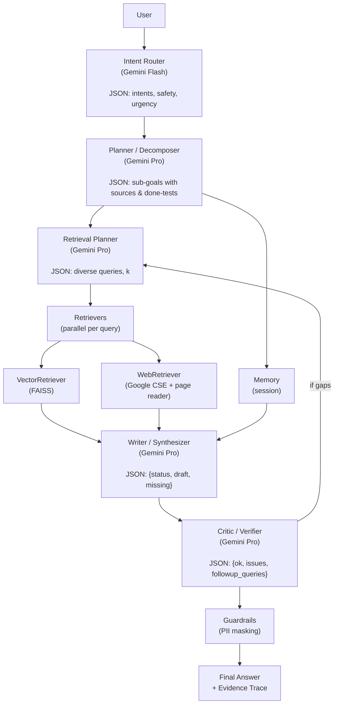

# Agentic RAG Pipeline (with Google Gemini LLM)

An end-to-end, production-ready **Agentic RAG** pipeline powered by **Google Gemini** (planning, writing, critique), **FAISS** (vector search), **Google Programmable Search** (hybrid web retrieval), and a simple, file-backed **session memory**.
It does **intent recognition**, **task decomposition**, **dynamic retrieval planning**, **multi-agent verification**, **tool/API calls**, and **guardrailed finalization**.

[](#)
[](#)
[](#)
[](#)
[](#)
[](#)
[](#)
[](#)
[](#)
[](#)
[](#)
[](#)
[](#)
[](#)
[](#)
[](#)
[](#)
[](#)
[](#)
[](#)
[](#)
[](#)
[](#)

---

## Contents

* [What you get](#what-you-get)
* [Architecture](#architecture)
* [Prerequisites](#prerequisites)
* [Web UI](#web-ui)
* [HTTP API](#http-api)
* [Install](#install)
* [Configure](#configure)
* [Run](#run)
* [How it works (step-by-step)](#how-it-works-step-by-step)
* [Project structure](#project-structure)
* [Agents (roles & prompts)](#agents-roles--prompts)
* [Corpus ingestion](#corpus-ingestion)
* [Hybrid retrieval (vector + web)](#hybrid-retrieval-vector--web)
* [Memory & context](#memory--context)
* [Quality control](#quality-control)
* [Tuning & production notes](#tuning--production-notes)
* [Troubleshooting](#troubleshooting)
* [FAQ](#faq)

---

## What you get

* **Agent network** with isolated LLM sessions (same model family, different prompts/params).
* **Dynamic retrieval loop** (query expansion, coverage checks, iterative refinement).
* **Task decomposition** for complex, multi-part user asks.
* **Hybrid search** (FAISS vector store + optional Google Programmable Search).
* **Self-critique** pass to catch unsupported claims and trigger targeted follow-ups.
* **Session memory** (file-backed JSONL) and pluggable episodic memory if you extend it.
* **Guardrails** (basic PII masking) ready for expansion.
* **Deterministic JSON** parsing & resilience to minor LLM formatting quirks.

---

## Architecture



**Do agents share the same LLM instance?**
Each agent runs its **own LLM session** (distinct system prompt, temperature, token budget) while pointing to the **same Gemini family** (e.g., 1.5 Pro/Flash). This isolates roles, enables parallelism, and simplifies telemetry/cost control.

---

## Prerequisites

* Python 3.10+
* Accounts/keys:

  * `GOOGLE_API_KEY` (required) for Gemini.
  * Optional `CSE_API_KEY` and `CSE_ENGINE_ID` for Google Programmable Search (web retrieval).
* Optional ingestion extras for multimodal support:
  * `pypdf` or `pdfminer.six` for PDF extraction
  * `python-docx` for DOCX extraction
  * `pillow` + `pytesseract` for image OCR

---

## Install

```bash
python -m venv .venv
source .venv/bin/activate  # Windows: .venv\Scripts\activate
pip install --upgrade pip
pip install google-generativeai faiss-cpu httpx requests beautifulsoup4 pydantic python-dotenv
# Optional (multimodal ingest)
pip install pypdf pdfminer.six python-docx pillow pytesseract
```

---

## Configure

1. **Environment variables** (create a `.env` in the project root):

```env
# Required
GOOGLE_API_KEY=your_gemini_api_key

# Optional (enable web retrieval)
CSE_API_KEY=your_google_cse_key
CSE_ENGINE_ID=your_google_cse_engine_id

# Optional (where to ingest local docs)
CORPUS_DIR=corpus
```

2. **Corpus (optional but recommended):**
   Drop `.txt` or `.md` files into `corpus/`. They’ll be chunked and embedded on startup.

**Environment variables quick reference**

| Name             | Required | Purpose                               |
| ---------------- | -------- | ------------------------------------- |
| GOOGLE\_API\_KEY | Yes      | Gemini API key                        |
| CSE\_API\_KEY    | No       | Google Programmable Search API key    |
| CSE\_ENGINE\_ID  | No       | Google CSE Engine ID                  |
| CORPUS\_DIR      | No       | Directory of local documents to index |

---

## Run

```bash
python app.py
```

You’ll see:

```
[ingest] Loading corpus from: corpus
[ingest] Added N chunks.
[web] Google Programmable Search enabled.   # if keys provided
```

Then type questions at the prompt:

```
>>> Compare the two documents in the corpus and list actionable next steps.
```

The system will plan, retrieve (vector + web if enabled), synthesize, critique, and output a grounded answer with a **Sources** list.

---

## Web UI

A zero-build Vue UI is included and mounted by the root FastAPI server.

```bash
uvicorn agentic_ai.app:app --reload
# Then open http://127.0.0.1:8000/rag
```

Features:
- Ask questions; results stream with markdown rendering.
- Ingest sources by URL, raw text, or upload files (.txt, .md, .pdf, .docx, .png/.jpg).
- Optional extras enable rich extraction for PDFs/DOCX/images.

Files:
- `Agentic-RAG-Pipeline/ui/index.html`
- `Agentic-RAG-Pipeline/ui/app.js`
- `Agentic-RAG-Pipeline/ui/styles.css`

---

## HTTP API

Endpoints (served by root FastAPI):

- `GET /api/rag/new_session` → `{ "session_id": "uuid" }`
- `POST /api/rag/ask` (SSE) with `{ "session_id": "uuid", "question": "..." }`
  - Events: `log`, `answer` (markdown), `sources` (JSON array), `done`.
- `POST /api/rag/ingest_text` to add text or a URL
  - `{ "text": "...", "id?": "doc-id", "title?": "...", "tags?": [ ... ] }`
  - or `{ "url": "https://...", "title?": "...", "tags?": [ ... ] }`
- `POST /api/rag/ingest_file` (multipart)
  - Form fields: `file`, `title?`, `tags?` (comma-separated)

All ingestion routes chunk text and add it to the in-memory FAISS index with metadata for later retrieval.

---

## How it works (step-by-step)

1. **Intent Router** classifies the task (answer/plan/code/etc.) and flags safety concerns.
2. **Planner** breaks the request into sub-goals with suggested sources (vector/web/db/tools) and a completion test.
3. **Retrieval Planner** generates **diverse queries** for each sub-goal and sets `k`.
4. **Retrievers** run hybrid search:

   * **Vector**: FAISS over your local corpus.
   * **Web**: Google CSE + HTML fetch + text extraction (optional).
5. **Writer** produces a **grounded draft** using only the provided evidence and adds bracketed citations.
6. **Critic** checks for unsupported claims or gaps and proposes **follow-up queries**; the orchestrator can re-retrieve and revise the draft once.
7. **Guardrails** redact emails/phones (extendable).
8. **Answer** + **evidence trace** is returned; session memory is updated.

---

## Project structure

```
agentic-rag/
  app.py
  services.py       # UI/API glue: shared index, ingestion, streaming
  core/
    llm.py           # Gemini client, embeddings, JSON helpers
    vector.py        # FAISS index + corpus ingestion
    tools.py         # Web search + page fetcher
    memory.py        # File-backed session memory
    structs.py       # Pydantic data contracts
  agents/
    base.py
    intent.py
    planner.py
    retrieval_planner.py
    retrievers.py
    writer.py
    critic.py
    guardrails.py
  graph/
    orchestrator.py  # The control flow / loop
  eval/
    harness.py       # Optional quick smoke tests
  corpus/            # (your .txt/.md docs)
  .session_memory/   # (generated)
  ui/                # Browser UI mounted at /rag
    index.html
    app.js
    styles.css
```

---

## Agents (roles & prompts)

* **IntentAgent (Flash):** returns JSON `{intents[], safety[], urgency, notes}`.
* **PlannerAgent (Pro):** returns ordered sub-goals with `sources` and `done_test`.
* **RetrievalPlannerAgent (Pro):** returns `{queries[], k}` per sub-goal.
* **VectorRetriever:** FAISS semantic search over chunked corpus.
* **WebRetriever:** Google CSE + page fetch; returns enriched evidence (title, URI, text).
* **WriterAgent (Pro):** grounded synthesis using only evidence; returns `{status, draft, missing}` with bracketed citations `[ #1 ]`.
* **CriticAgent (Pro):** returns `{ok, issues, followup_queries}`; triggers one targeted repair loop.
* **GuardrailsAgent:** minimal email/phone redaction; extend with policies/PII rules.

**LLM instances:** each agent uses its **own** Gemini session & parameters. Same model family (e.g., `gemini-1.5-pro`), different prompts and budgets.

---

## Corpus ingestion

* Put `.txt` / `.md` files in `corpus/`.
* The loader does simple **character-based chunking** (size 1200, overlap 200).
  For production, consider token-aware splitters (e.g., by heading/paragraph) and metadata-rich chunking.
* Embeddings: `text-embedding-004` (768-dim). FAISS uses inner-product on normalized vectors.

**Tip:** Create a file like `corpus/knowledge.md` with key facts, glossaries, or SOPs for stronger grounding.

---

## Hybrid retrieval (vector + web)

* **Vector** hits are fast and usually precise for your private KB.
* **Web** (optional) broadens coverage and provides fresh/public context:

  * Requires `CSE_API_KEY` and `CSE_ENGINE_ID`.
  * Each hit is fetched and cleaned with BeautifulSoup, capped to 20k chars, then truncated to a reasonable snippet for evidence.

**Tuning knobs (see `graph/orchestrator.py`):**

* `k` per sub-goal from Retrieval Planner (bounded to 4–12).
* Per-subtask and global **dedupe** of evidence (by `(uri, chunk_id)`).
* Evidence cap to avoid prompt bloat, with an additional safety truncation.

---

## Memory & context

* **Session memory**: file-backed JSONL under `.session_memory/SESSION_ID.jsonl`.
  The orchestrator appends user and assistant messages and can generate a short summary window for context.
* **Episodic memory**: not enabled by default; easiest path is to add another FAISS index (or pgvector) to store distilled user facts/preferences and query it alongside the main vector store.

---

## Quality control

* **Coverage via planning:** Sub-goals specify `done_test`. The critic evaluates whether the draft meets it; if not, it proposes follow-ups.
* **Self-critique loop:** One repair iteration by default to balance latency & cost.
* **Citations:** Writer cites evidence using bracket indices mapped to the evidence array order.
* **Guardrails:** Simple PII maskers out of the box; wire compliance, redaction, and policy checks as needed.

---

## Tuning & production notes

* **Temperatures:**

  * Router/Planner/Ret-Planner/Writer: `0.1–0.3` for determinism.
  * Critic: `~0.1` to keep follow-ups targeted.
* **Chunk size:** Start with 800–1500 chars, overlap 150–250. Reduce overlap for very large corpora.
* **k (top-K):** Begin at 6–8. Lower for tight latency, higher for recall-critical tasks.
* **Latency & cost:**

  * Disable web for intranet-only workloads.
  * Cache embeddings and web page fetches.
  * Parallelize retrievers per query if you add asyncio and rate-limiters.
* **Observability:**

  * Add structured logs per agent (input/output tokens, latency).
  * Emit OpenTelemetry spans per step; track failure modes (JSON parse errors, HTTP timeouts).
* **Security:**

  * Never embed secrets; redact before vectorization.
  * Use a secret manager (GCP Secret Manager) for keys in production.
  * Consider domain allow-lists for web retrieval.
* **Scaling:**

  * Swap FAISS for pgvector/Weaviate/Pinecone for horizontal scaling.
  * Move memory from file to Redis/DB.
  * Add queues (e.g., Cloud Run/Cloud Tasks) for long jobs.

---

## Troubleshooting

**`GOOGLE_API_KEY is required`**
Set it in `.env` or your shell environment.

**Web search always disabled**
Set both `CSE_API_KEY` and `CSE_ENGINE_ID` (and ensure your CSE is configured to search the web or desired domains).

**Empty/weak answers**

* Place more/better content in `corpus/`.
* Increase `k` or chunk size in `core/vector.py`.
* Verify that pages fetch properly (some sites block scraping).

**“JSON parsing” warnings (rare)**
The pipeline is resilient and attempts to coerce malformed JSON. If it recurs, lower temperatures.

**Slow runs**
Disable web, reduce `k`, or remove the critic loop in `orchestrator.py`.

---

## FAQ

**Q: Does each agent use an instance of the LLM?**
A: **Yes.** Each agent maintains its **own Gemini session & config** (system prompt, temperature, token limits). They typically use the same **base model** (Gemini 1.5 Pro for planning/writing/critique; Gemini 1.5 Flash for routing/guardrails).

**Q: Can I run without web search?**
A: Yes. The system runs vector-only if `CSE_API_KEY`/`CSE_ENGINE_ID` aren’t set.

**Q: How do I add a custom tool/API (e.g., SQL, Jira, GitHub)?**
A: Add a client in `core/tools.py`, create a dedicated Agent (e.g., `DataAgent`) with restricted prompts/permissions, and call it from the orchestrator based on sub-goal `sources` or intent routing.

**Q: How do I swap FAISS for pgvector/Pinecone?**
A: Replace `FAISSIndex` with your client; keep the `add()`/`search()` signatures. Most adapters are a few dozen lines.

**Q: How do I change models or parameters?**
A: Edit `core/llm.py` (`GEMINI_PRO`, `GEMINI_FLASH`, temperatures, max tokens). You can also route some roles to `Flash` for cost/latency.

---

## Quick commands

```bash
# 1) Install deps
pip install google-generativeai faiss-cpu httpx requests beautifulsoup4 pydantic python-dotenv

# 2) Configure keys
echo "GOOGLE_API_KEY=sk-..." >> .env
# Optional web:
echo "CSE_API_KEY=..." >> .env
echo "CSE_ENGINE_ID=..." >> .env

# 3) Add local docs (optional)
mkdir -p corpus
echo "Your internal SOPs or notes go here." > corpus/notes.md

# 4) Run
python app.py
```

---

This pipeline is designed to be a solid foundation for building advanced, agentic RAG systems with Gemini. It can be extended with more agents, tools, and retrieval methods as needed. Happy coding!
