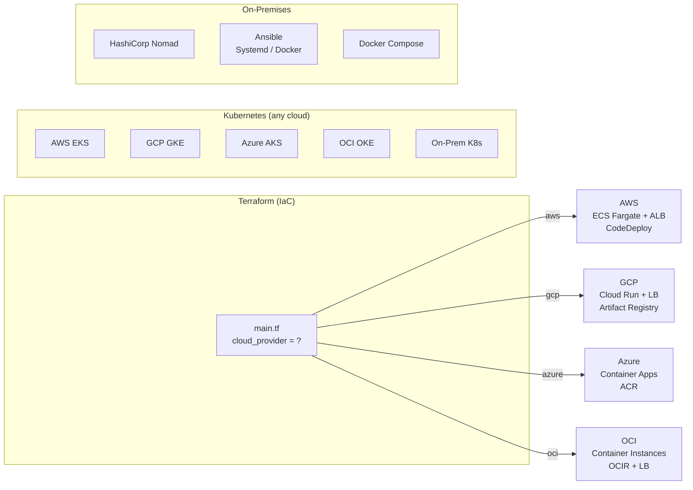

# Advanced Deployment & DevOps Infrastructure

This document outlines the advanced deployment and DevOps infrastructure implemented for the Research Outreach Agentic AI project. It details the new deployment strategies, automation scripts, GitOps configurations, and monitoring setups added to enhance the existing Kubernetes and AWS ECS environments.

## Deployment Strategies

### 🔵🟢 Blue/Green Deployments

**Kubernetes:**
- Dual deployment configurations (blue/green)
- Service-based traffic switching
- Persistent volume claims for shared state
- Zero-downtime deployment script

**AWS ECS:**
- Terraform module with CodeDeploy integration
- Dual ALB target groups
- Automated deployment script
- Test listener for pre-production validation

**Location:**
- `k8s/blue-green/` - Kubernetes manifests
- `hashicorp/terraform/modules/ecs_blue_green/` - ECS Terraform module
- `scripts/blue_green_deploy.sh` - K8s automation
- `scripts/ecs_blue_green_deploy.sh` - ECS automation

### 🕯️ Canary Deployments

**Native Kubernetes:**
- Stable and canary deployments
- NGINX Ingress-based traffic splitting
- Progressive rollout automation
- Manual control script

**Flagger Integration:**
- Automated progressive delivery
- Prometheus metrics analysis
- Load testing integration
- Auto-rollback on failures

**AWS ECS:**
- Terraform module with weighted target groups
- Separate stable/canary services
- Configurable traffic distribution

**Location:**
- `k8s/canary/` - Kubernetes manifests
- `hashicorp/terraform/modules/ecs_canary/` - ECS Terraform module
- `scripts/canary_deploy.sh` - Canary automation
- `k8s/canary/flagger-canary.yaml` - Flagger config
- `k8s/canary/hpa.yaml` - Horizontal Pod Autoscaler

### 📊 GitOps Configurations

**ArgoCD:**
- Application manifests for standard, blue/green, and canary
- AppProject with RBAC and sync windows
- Argo Rollouts progressive delivery
- Analysis templates for metrics-based promotion

**Flux v2:**
- GitRepository sources
- Kustomization configs for all strategies
- Image automation and scanning
- Slack notifications
- Multi-environment support

**Location:**
- `gitops/argocd/` - All ArgoCD configurations
- `gitops/flux/` - All Flux configurations

### 🛠️ Deployment Automation Scripts

1. **Blue/Green Deployment** (`scripts/blue_green_deploy.sh`)
   - Automated image updates
   - Health check validation
   - Interactive traffic switching
   - Rollback instructions

2. **Canary Deployment** (`scripts/canary_deploy.sh`)
   - Manual progressive rollout
   - Flagger automated mode
   - Smoke testing
   - Metrics monitoring prompts

3. **ECS Blue/Green** (`scripts/ecs_blue_green_deploy.sh`)
   - Task definition updates
   - CodeDeploy integration
   - Deployment monitoring
   - Status reporting

4. **Deployment Monitor** (`scripts/deployment_monitor.sh`)
   - Continuous health checks
   - Pod, service, and log monitoring
   - Resource usage tracking
   - Auto-rollback capability

5. **Quick Rollback** (`scripts/rollback.sh`)
   - Blue/green rollback
   - Canary rollback
   - Standard deployment rollback
   - Emergency procedures

### 📚 Documentation

- `docs/ADVANCED_DEPLOYMENTS.md` - Comprehensive guide covering all strategies
- `docs/DEPLOYMENT_QUICKSTART.md` - Quick reference and commands
- `DEPLOYMENTS_README.md` - This file

## Quick Start

### Blue/Green Deployment

```bash
# Kubernetes
kubectl apply -f k8s/blue-green/
./scripts/blue_green_deploy.sh green agentic-ai:v1.2.0

# ECS
cd hashicorp/terraform/modules/ecs_blue_green
terraform init && terraform apply
AWS_REGION=us-west-2 ./scripts/ecs_blue_green_deploy.sh v1.2.0
```

### Canary Deployment

```bash
# Kubernetes with NGINX Ingress
kubectl apply -f k8s/canary/
./scripts/canary_deploy.sh manual agentic-ai:v1.2.0

# Flagger Automated
kubectl apply -f k8s/canary/flagger-canary.yaml
kubectl set image deployment/agentic-ai app=agentic-ai:v1.2.0
```

### GitOps Setup

```bash
# ArgoCD
kubectl create namespace argocd
kubectl apply -n argocd -f https://raw.githubusercontent.com/argoproj/argo-cd/stable/manifests/install.yaml
kubectl apply -f gitops/argocd/application.yaml

# Flux
flux bootstrap github --owner=hoangsonww --repository=Agentic-AI-Pipeline
kubectl apply -f gitops/flux/gotk-sync.yaml
```

## Infrastructure Summary

### Kubernetes Resources Created

- **Blue/Green:**
  - 2 Deployments (blue, green)
  - 1 Service (traffic router)
  - 2 PersistentVolumeClaims

- **Canary:**
  - 2 Deployments (stable, canary)
  - 2 Services (stable, canary)
  - 2 Ingresses (stable, canary with weights)
  - 1 HorizontalPodAutoscaler
  - 1 Flagger Canary CRD

- **GitOps:**
  - 3 ArgoCD Applications
  - 1 ArgoCD AppProject
  - 1 Argo Rollout
  - 2 Analysis Templates
  - 5 Flux Kustomizations
  - Image automation resources

### AWS Resources (Terraform)

- **Blue/Green Module:**
  - ECS Cluster
  - 2 Target Groups (blue, green)
  - Application Load Balancer
  - 2 Listeners (production, test)
  - CodeDeploy Application & Deployment Group
  - ECR Repository
  - CloudWatch Log Groups
  - IAM Roles

- **Canary Module:**
  - ECS Cluster
  - 2 ECS Services (stable, canary)
  - 2 Target Groups (weighted)
  - Application Load Balancer
  - 2 CloudWatch Log Groups
  - ECR Repository

## Deployment Strategies Comparison

| Strategy | Use Case | Rollback Speed | Traffic Control | Automation |
|----------|----------|----------------|-----------------|------------|
| **Blue/Green** | Major releases, database migrations | Instant | All-or-nothing | Script-based |
| **Canary (Manual)** | Gradual validation needed | Fast | Progressive | Interactive |
| **Canary (Flagger)** | Automated progressive delivery | Very Fast | Progressive | Fully automated |
| **GitOps (ArgoCD)** | Declarative, auditable deploys | Fast | Configurable | Git-driven |
| **GitOps (Flux)** | Image-driven, automated | Fast | Configurable | Fully automated |

## Monitoring & Observability

All deployment strategies include:

- **Health Checks**: HTTP liveness and readiness probes
- **Logging**: Centralized via CloudWatch or stdout
- **Metrics**: Resource usage, error rates, latency
- **Auto-rollback**: Configurable failure thresholds
- **Alerting**: Via Slack/PagerDuty (Flux/ArgoCD)

Required for production:
- Prometheus for metrics
- Grafana for dashboards
- AlertManager for alerting
- Flagger for automated canary analysis

## Best Practices Implemented

✅ **Zero-downtime deployments** - Traffic switching with no interruption
✅ **Health validation** - Automated checks before traffic switch
✅ **Progressive rollouts** - Gradual traffic increase for risk mitigation
✅ **Quick rollback** - One-command rollback procedures
✅ **Infrastructure as Code** - Terraform modules for AWS resources
✅ **GitOps** - Declarative, version-controlled deployments
✅ **Automated monitoring** - Continuous health checks with auto-rollback
✅ **Multi-platform** - Both Kubernetes and AWS ECS support
✅ **Documentation** - Comprehensive guides and quick references

## Advanced Features

### Traffic Management
- NGINX Ingress weighted routing
- ALB weighted target groups
- Session affinity/stickiness
- Header-based routing (canary by header)

### Automated Analysis
- Prometheus metrics queries
- Success rate monitoring (>95%)
- Latency monitoring (P99 <500ms)
- Custom metric support

### Rollback Automation
- Health check failures trigger rollback
- Error rate threshold monitoring
- Resource exhaustion detection
- Manual emergency rollback script

### Security
- RBAC for ArgoCD/Flux
- Sync windows for controlled deployments
- Secrets management integration points
- Image scanning recommendations

## Integration Points

The deployment infrastructure integrates with:

- **CI/CD**: Existing GitHub Actions (not modified)
- **Container Registry**: ECR, Docker Hub, private registries
- **Secrets**: Kubernetes Secrets, AWS Secrets Manager
- **Monitoring**: Prometheus, CloudWatch, Datadog
- **Alerting**: Slack, PagerDuty, email
- **Image Scanning**: Trivy, Snyk (recommended)

## Next Steps

1. **Configure monitoring:**
   ```bash
   # Install Prometheus and Grafana
   helm install prometheus prometheus-community/kube-prometheus-stack
   ```

2. **Set up Slack notifications:**
   ```bash
   # For Flux
   kubectl create secret generic slack-webhook-url \
     -n flux-system --from-literal=address=<webhook-url>
   ```

3. **Deploy to staging first:**
   ```bash
   NAMESPACE=staging ./scripts/blue_green_deploy.sh green agentic-ai:v1.2.0
   ```

4. **Test rollback procedures:**
   ```bash
   ./scripts/rollback.sh blue-green blue
   ```

5. **Enable image automation (Flux):**
   ```bash
   kubectl apply -f gitops/flux/image-automation.yaml
   ```

## Troubleshooting

See detailed troubleshooting in `docs/ADVANCED_DEPLOYMENTS.md`.

Quick commands:
```bash
# Check deployment status
kubectl rollout status deployment/agentic-ai

# View logs
kubectl logs -f deployment/agentic-ai

# Check health
./scripts/deployment_monitor.sh agentic-ai

# Emergency rollback
./scripts/rollback.sh <strategy> <target>
```

## Multi-Cloud Provider Support

This project supports deployment to **any major cloud provider** or on-premises infrastructure:



### Cloud Provider Quick Start

| Provider | Command | Module |
|----------|---------|--------|
| **AWS** | `terraform apply -var="cloud_provider=aws"` | `modules/ecs_fargate/` |
| **GCP** | `terraform apply -var="cloud_provider=gcp"` | `modules/gcp_cloud_run/` |
| **Azure** | `terraform apply -var="cloud_provider=azure"` | `modules/azure_container_apps/` |
| **OCI** | `terraform apply -var="cloud_provider=oci"` | `modules/oci_container_instances/` |
| **K8s** | `kubectl apply -f k8s/` | Any K8s cluster (EKS/GKE/AKS/OKE/on-prem) |
| **Nomad** | `nomad job run hashicorp/nomad/agentic-ai.nomad` | HashiCorp Nomad |
| **On-prem** | `ansible-playbook ansible/playbooks/site.yml` | Ansible + systemd |
| **Docker** | `docker compose up -d` | Docker Compose |

### Terraform Multi-Provider Usage

```bash
cd hashicorp/terraform

# AWS deployment
terraform init
terraform plan -var="cloud_provider=aws" -var="vpc_id=vpc-xxx" -var="public_subnets=[\"subnet-a\",\"subnet-b\"]"
terraform apply

# GCP deployment
terraform plan -var="cloud_provider=gcp" -var="gcp_project_id=my-project"
terraform apply

# Azure deployment
terraform plan -var="cloud_provider=azure" -var="azure_resource_group=agentic-ai-rg"
terraform apply

# OCI deployment
terraform plan -var="cloud_provider=oci" -var="oci_compartment_id=ocid1.compartment..."
terraform apply
```

### On-Premises Deployment

```bash
# Option 1: Ansible (systemd service on bare metal)
cd ansible
ansible-playbook -i inventories/prod/hosts.ini playbooks/site.yml

# Option 2: Ansible (Docker on bare metal)
ansible-playbook -i inventories/prod/hosts.ini playbooks/docker.yml

# Option 3: HashiCorp Nomad
nomad job run hashicorp/nomad/agentic-ai.nomad

# Option 4: Docker Compose (simplest)
docker compose up -d
```

### Security: HashiCorp Vault Integration

```bash
# Write secrets
vault kv put secret/agentic-ai/api-keys \
  openai_api_key=sk-... \
  anthropic_api_key=sk-ant-... \
  google_api_key=AIza...

# Apply policy
vault policy write agentic-ai hashicorp/vault/agentic-ai-policy.hcl
```

### Kubernetes Security (all providers)

```bash
# Apply namespace with pod security standards
kubectl apply -f k8s/pod-security.yaml

# Apply network policies
kubectl apply -f k8s/network-policy.yaml
```

## Support and Resources

- **Kubernetes Docs**: https://kubernetes.io/docs/
- **ArgoCD**: https://argo-cd.readthedocs.io/
- **Flux**: https://fluxcd.io/docs/
- **Flagger**: https://docs.flagger.app/
- **Terraform AWS**: https://registry.terraform.io/providers/hashicorp/aws/
- **Terraform GCP**: https://registry.terraform.io/providers/hashicorp/google/
- **Terraform Azure**: https://registry.terraform.io/providers/hashicorp/azurerm/
- **Terraform OCI**: https://registry.terraform.io/providers/oracle/oci/
- **HashiCorp Nomad**: https://developer.hashicorp.com/nomad/docs
- **HashiCorp Vault**: https://developer.hashicorp.com/vault/docs
