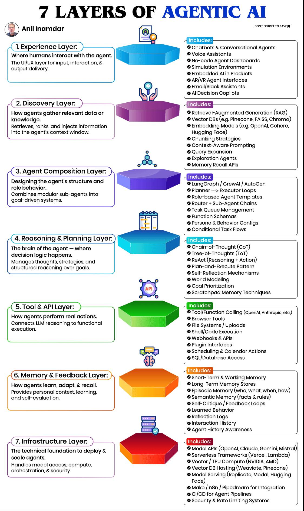
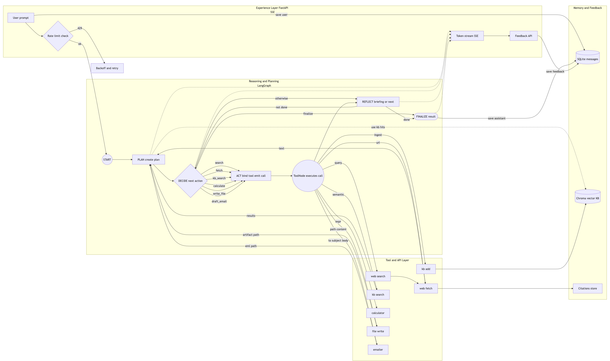
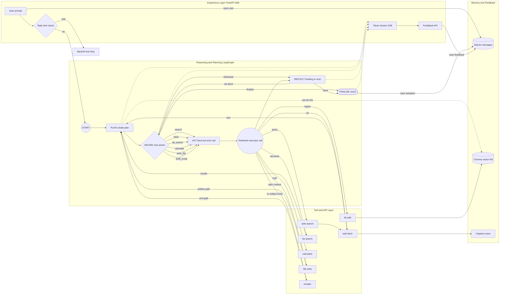
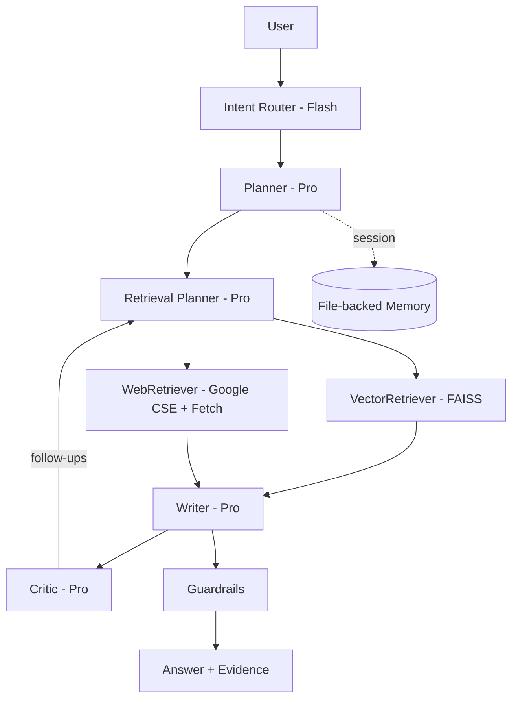
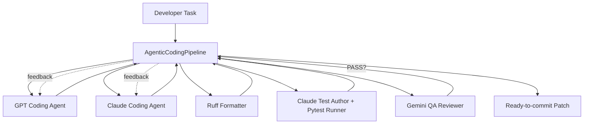

# Agentic Multi‑Stage Bot - A Research & Outreach Agent 🤖

[](#)
[](#)
[](#)
[](#)
[](#)
[](#)
[](#)
[](#)
[](#)
[](#)
[](#)
[](#)
[](#)
[](#)
[](#)
[](#)
[](#)
[](#)
[](#)
[](#)
[](#)
[](#)
[](#)

A **full‑fledged, multi‑stage, agentic chatbot** that **plans → discovers → reasons → uses tools → learns**.
The reference task baked into this repo is a **Research & Outreach Agent** (“**DossierOutreachAgent**”): given a topic/company, it builds a **compact, cited briefing** and (optionally) **drafts an outreach email**, saving artifacts to disk.

## Table of Contents

* [Key Features](#key-features)
* [7‑Layer Architecture](#7-layer-architecture)
* [Agent Graph (LangGraph)](#agent-graph-langgraph)
* [Repository Layout](#repository-layout)
* [Bonus: Agentic RAG](#bonus-agentic-rag)
* [Bonus: Agentic Coding Pipeline](#bonus-agentic-coding-pipeline)
* [Quickstart](#quickstart)
* [Configuration](#configuration)
* [Running](#running)
* [CLI Utilities](#cli-utilities)
* [HTTP API](#http-api)
* [Tools & Capabilities](#tools--capabilities)
* [Memory & Feedback](#memory--feedback)
* [Extending the System](#extending-the-system)
* [Testing & Quality](#testing--quality)
* [GitHub Actions](#github-actions)
* [Security & Ops](#security--ops)
* [Troubleshooting](#troubleshooting)
* [Roadmap Ideas](#roadmap-ideas)

## Key Features

* **Multi‑stage reasoning & planning** with **LangGraph** state machine (plan → decide → act → tools → reflect → finalize).
* **Autonomous tool use & tool‑chaining** (web search, URL fetch, calculator, file write, email draft, KB search/add).
* **Two memory systems**:

  * **SQLite** conversation store (turn history, feedback).
  * **ChromaDB** vector KB for **RAG** and persistent knowledge.
* **Web experience layer**: minimal **FastAPI** + **SSE** streaming UI (no framework lock‑in).
* **CLI** for ingestion & demos.
* **Rate limiting** (token bucket) per chat.
* **Batteries‑included tests** (unit + smoke), lint, formatting, and ready Makefile targets.
* **Opinionated architecture**: 7‑layer separation, single action per step, reflect‑first finalization.
* **Extensible**: add new tools, nodes, or agent profiles without breaking the core.
* **Production ready**: designed for real‑world use with security, observability, and extensibility in mind.
* **Open Source**: Apache licensed, built with community contributions in mind.

---

## 7-Layer Architecture

This system is designed with a **7-layer architecture** to separate concerns and allow for easy extension. Each layer has a specific role, and they communicate through well-defined interfaces. The core agent logic is implemented in LangGraph, which orchestrates the reasoning and tool use.

> [!NOTE]
> **Agent ≠ LLM.** This system implements a layered design that’s easy to extend and operate.

```
Experience (UI/API)
   └─ FastAPI + SSE → web UI, CLI, REST
Discovery
   └─ WebSearch, WebFetch, KB search (RAG)
Agent Composition
   └─ Agent profile (persona, objective, capabilities)
Reasoning & Planning
   └─ LangGraph plan→decide→act→reflect→finalize
Tool & API
   └─ Calculator, FileWrite, Emailer, Web tools, KB add/search
Memory & Feedback
   └─ SQLite (turns, feedback), ChromaDB (vector KB)
Infrastructure
   └─ Logging, rate limiting, config, packaging
```

**Directory mapping**

| Layer                | Where                                                    |
| -------------------- | -------------------------------------------------------- |
| Experience           | `src/agentic_ai/app.py`, `web/`                          |
| Discovery            | `src/agentic_ai/tools/webtools.py`, `tools/knowledge.py` |
| Agent Composition    | `src/agentic_ai/layers/composition.py`                   |
| Reasoning & Planning | `src/agentic_ai/layers/reasoning.py`, `graph.py`         |
| Tools & API          | `src/agentic_ai/tools/*`, `layers/tools.py`              |
| Memory & Feedback    | `src/agentic_ai/memory/*`, `layers/memory.py`            |
| Infrastructure       | `src/agentic_ai/infra/*`, `config.py`, `pyproject.toml`  |

By separating these layers, we ensure that each component can evolve independently while maintaining a clear contract with the others. This modularity allows for easy testing, debugging, and extension of the system.

<p align="center">
    
</p>

> Credit: Anil Inamdar for the original 7-layer architecture diagram and for the inspiration behind the agentic design principles.

## Agent Graph (LangGraph)

The agent runs a **typed state machine** driving the LLM and tools. It uses **LangGraph** to orchestrate the reasoning and tool use, with a focus on **single atomic actions** per step. This design ensures clarity in execution and allows for easy debugging and extensibility.

<p align="center">
    
</p>

Dynamic Mermaid graph of the agent's architecture:



The graph consists of the following key nodes:

* **PLAN**: creates a short action plan (3–6 steps), with **KB context** pre‑retrieval.
* **DECIDE**: selects the next atomic action (token): `search`, `fetch`, `kb_search`, `calculate`, `write_file`, `draft_email`, or `finalize`.
* **ACT**: binds LLM to tool schema and forces a **single precise tool call**.
* **TOOLS**: concrete execution via LangGraph `ToolNode`.
* **REFLECT**: either emits `BRIEFING: ...` (final) or `NEXT: <action>`.
* **FINALIZE**: completes, persisting the result.

This design ensures that each step is clear and focused, allowing for easy debugging and understanding of the agent's behavior. The use of LangGraph allows for powerful state management and tool orchestration, making it a robust solution for building agentic systems.

## Repository Layout

```
Agentic-RAG-Pipeline/     # Bonus: full agentic RAG pipeline in addition to this bot
Makefile                  # Common tasks (setup, ingest, run, test)
requirements.txt          # Python dependencies
src/
  agentic_ai/
    app.py                # FastAPI app (Experience)
    graph.py              # LangGraph runner
    cli.py                # CLI utilities (ingest/demo)
    config.py             # Pydantic settings
    infra/
      logging.py          # Rotating logs
      rate_limit.py       # Token bucket
    memory/
      sql_store.py        # SQLite conversation store
      vector_store.py     # ChromaDB KB
    layers/
      composition.py      # Agent profile
      reasoning.py        # Plan→Decide→Act→Reflect graph
      memory.py           # Memory orchestrator helpers
      tools.py            # Tool registry
    tools/
      webtools.py         # DuckDuckGo search + URL fetch & extract
      ops.py              # Calculator, FileWrite, Emailer (mock)
      knowledge.py        # KB add/search tools
web/
  index.html styles.css app.js
data/
  seed/                   # Non-empty RAG seeds
  agent_output/          # FileWrite artifacts
  emails/                # Emailer artifacts
tests/
  ... (unit & smoke)
```

> [!IMPORTANT]
> This layout separates concerns clearly, with `src/agentic_ai` containing the core logic, `web/` for the UI, and `data/` for input/output artifacts. The `tests/` directory holds unit and smoke tests to ensure code quality.

## Bonus: Agentic RAG

Looking for a **full agentic RAG pipeline** (multi-step plan → retrieve → reflect → verify → answer) with memory, tool use, and quality checks? Check out the companion project **Agentic-RAG-Pipeline** for a complete, production-grade implementation and deeper docs.

> [!TIP]
> See **[Agentic-RAG-Pipeline Directory](Agentic-RAG-Pipeline/README.md)** for more info and end-to-end code.



## Bonus: Agentic Coding Pipeline

Need an **autonomous coding assistant** that drafts patches, formats them, synthesizes tests, runs quality gates, and iterates until everything passes? The companion **Agentic Coding Pipeline** coordinates GPT + Claude coders, Ruff formatting, pytest execution, and Gemini QA review through the same shared MCP bus that powers the rest of this monorepo.

> [!TIP]
> See **[Agentic-Coding-Pipeline Directory](Agentic-Coding-Pipeline/README.md)** for setup, architecture, and customization notes.



* **Multi-LLM pair programming** keeps GPT and Claude coders in lockstep via a shared state dictionary.
* **Tool-backed gates** ensure Ruff formatting, pytest verification, and Gemini QA review all pass before the pipeline returns success.
* **Iterative retry logic** loops until a completed state is reached or the max iteration budget is exhausted, surfacing feedback for humans or follow-up agents.

```bash
cd Agentic-Coding-Pipeline
python run.py "Add pagination support to the API client"
```

## Quickstart

To quickly get started with the Agentic AI bot, follow these steps:

```bash
# 1) Create venv & install
python -m venv .venv
. .venv/bin/activate
pip install -U pip
pip install -r requirements.txt

# 2) Configure model keys
cp .env.example .env
# Edit .env with your OPENAI_API_KEY (or ANTHROPIC_API_KEY) and preferences

# 3) Ingest seed knowledge into vector store
make ingest

# 4) Run the server
make run
# Open http://localhost:8000 and ask:
# "Build a competitive briefing on ACME Robotics and draft a short outreach email."
```

**CLI demo (streams to stdout)**

```bash
. .venv/bin/activate
python -m agentic_ai.cli demo "Summarize top AMR vendors for grocery DCs with citations"
```

This will start the agent, which will plan, search, and reflect on the topic, providing a compact briefing with citations. You can also use the CLI to ingest additional documents into the vector knowledge base.

## Configuration

The app uses **Pydantic Settings** and `.env`.

```env
MODEL_PROVIDER=openai          # openai | anthropic
OPENAI_API_KEY=sk-...          # required if MODEL_PROVIDER=openai
OPENAI_MODEL_CHAT=gpt-4o-mini
OPENAI_MODEL_EMBED=text-embedding-3-small

ANTHROPIC_API_KEY=sk-ant-...   # required if MODEL_PROVIDER=anthropic
ANTHROPIC_MODEL_CHAT=claude-3-5-sonnet-latest

CHROMA_DIR=.chroma
SQLITE_PATH=.sqlite/agent.db

APP_HOST=0.0.0.0
APP_PORT=8000
```

> You can switch providers at runtime by changing `MODEL_PROVIDER` and the corresponding keys/models.

## Running

We recommend using a **virtual environment** to isolate dependencies. The provided Makefile simplifies setup and common tasks:

**Makefile targets**

* `make setup` – create venv, install deps, copy `.env.example`
* `make ingest` – add files under `data/seed/` to the vector KB
* `make run` – launch **FastAPI** on configured host/port
* `make test` – run unit tests
* `make format` / `make lint` – apply/check `ruff` (imports + formatting)

**Run the server**

```bash
. .venv/bin/activate
uvicorn src.agentic_ai.app:app --host
```

This will start the FastAPI server on `http://localhost:8000`, where you can interact with the agent via the web UI or API.

## CLI Utilities

This repository also provides a CLI for quick interactions and ingestion of knowledge:

```bash
# Ingest any folder recursively (adds text up to 10k chars per file)
python -m agentic_ai.cli ingest ./data/seed

# Run a single prompt through the graph (streams responses)
python -m agentic_ai.cli demo "Give me a briefing on collaborative robots with citations"
```

The CLI allows you to quickly test the agent's capabilities without needing to set up the web UI. It streams responses directly to the console, making it easy to see how the agent processes prompts and uses tools.

## HTTP API

A simple HTTP API is provided for programmatic access to the agent's capabilities. It supports both synchronous and streaming interactions:

### `GET /api/new_chat`

Returns a new `chat_id`.

### `POST /api/chat` (SSE stream)

**Request body**

```json
{ "chat_id": "uuid-string", "message": "Your prompt" }
```

**Stream events**

* `event: token` – incremental text chunks
* `event: done` – `{"chat_id": "..."}`

### `POST /api/ingest`

Add an internal KB document.

```json
{ "id": "doc-123", "text": "content...", "metadata": { "source": "..." } }
```

### `POST /api/feedback`

Attach a rating/comment to a chat/message.

```json
{ "chat_id": "uuid", "message_id": null, "rating": 1, "comment": "👍" }
```

This API allows you to integrate the agent into your applications, enabling programmatic access to its reasoning and tool capabilities. The SSE stream provides real-time updates, making it suitable for interactive applications. Feedback can be used to improve the agent's performance over time.

## Tools & Capabilities

The agent uses a set of **atomic tools** to perform actions. Each tool is designed for a specific purpose, and they can be chained together to achieve complex tasks. The tools are registered in the `tools.py` layer and can be invoked by the agent during reasoning.

| Tool         | Name           | Purpose                                      | Input                     | Output                          |
| ------------ | -------------- | -------------------------------------------- | ------------------------- | ------------------------------- |
| `web_search` | WebSearch      | General discovery                            | NL query                  | JSON list of results            |
| `web_fetch`  | WebFetch       | Extract readable text from URL               | URL                       | Clean text                      |
| `kb_search`  | KbSearch       | Vector KB semantic search                    | NL query                  | JSON list of {id,text,metadata} |
| `kb_add`     | KbAdd          | Add doc to KB                                | JSON `{id,text,metadata}` | `"ok"`                          |
| `calculator` | Calculator     | Safe math via `math` module                  | Expression                | Result string                   |
| `file_write` | FileWrite      | Persist artifacts under `data/agent_output/` | JSON `{path,content}`     | Absolute path                   |
| `emailer`    | Emailer (mock) | Draft/queue email as `.eml`                  | JSON `{to,subject,body}`  | `.eml` path                     |

**Tool‑chaining** is managed by the graph: `DECIDE` picks one atomic action per step, `ACT` binds tools and **forces one structured call**, `TOOLS` executes, `REFLECT` synthesizes or continues.

This design ensures that each tool is used in a controlled manner, allowing for clear reasoning and traceability of actions. The agent can also reflect on its actions and decide whether to finalize or continue with further steps.

## Memory & Feedback

The agent has two memory systems to persist conversation history and knowledge:

* **Conversation turns**: persisted in **SQLite** via `SQLStore` (`messages` table holds `role`, `content`, `tool_call`).
* **Vector KB**: **ChromaDB** persistent collection; `kb_add` and `kb_search` power **RAG** and context for planning.
* **Feedback**: optional `feedback` table (rating + comment), useful for reinforcement signals and post‑hoc analysis.

**DB schema (simplified)**

```sql
CREATE TABLE IF NOT EXISTS chats (
  id TEXT PRIMARY KEY,
  created_at TIMESTAMP DEFAULT CURRENT_TIMESTAMP,
  title TEXT
);
CREATE TABLE IF NOT EXISTS messages (
  id INTEGER PRIMARY KEY AUTOINCREMENT,
  chat_id TEXT,
  role TEXT,
  content TEXT,
  tool_call TEXT,
  created_at TIMESTAMP DEFAULT CURRENT_TIMESTAMP
);
CREATE TABLE IF NOT EXISTS feedback (
  id INTEGER PRIMARY KEY AUTOINCREMENT,
  chat_id TEXT,
  message_id INTEGER,
  rating INTEGER,
  comment TEXT,
  created_at TIMESTAMP DEFAULT CURRENT_TIMESTAMP
);
```

Feel free to extend the memory layer with additional tables or fields as needed. The agent can use this memory to maintain context across interactions, allowing for more coherent and informed responses. More details on the memory layer can be found in `src/agentic_ai/memory/`.

## Extending the System

To extend the system, you can add new tools, nodes, or modify the agent profile. Here are some guidelines:

### Add a new Tool

1. Create `src/agentic_ai/tools/<your_tool>.py` implementing a `BaseTool` with `_run`.
2. Register it in `src/agentic_ai/layers/tools.py::registry()`.
3. Teach the decision policy by adding the token to `DECIDE`’s prompt and mapping in `ACT`.

### Add a new Node (LangGraph)

* Add a function `(state) -> state`, `g.add_node("name", fn)`, and wire edges.
* Prefer **small atomic** nodes; use `reflect` to decide if you have enough evidence to finalize.

### Change the Agent Profile

* Edit `layers/composition.py::PROFILE` (persona, objective, capabilities).
* Provide role or safety constraints in `SYSTEM` prompt in `layers/reasoning.py`.

### Use Another Vector DB / Embeddings

* Replace `VectorStore` implementation and/or embedding function.
* Adjust ingestion (`cli.py`) and KB tool wiring accordingly.

The system is designed to be modular and extensible, allowing you to adapt it to your specific use cases. The LangGraph framework provides a powerful way to manage the agent's reasoning and tool use, making it easy to add new capabilities without disrupting existing functionality.

> [!TIP]
> Feel free to experiment with different tools, nodes, and configurations to tailor the agent to your needs. The modular design allows for easy testing and iteration, making it a flexible platform for building agentic systems!

## Testing & Quality

This repository includes a comprehensive suite of tests to ensure code quality and functionality. The tests cover unit tests for individual components, as well as smoke tests for end-to-end scenarios.

**Run all tests**

```bash
. .venv/bin/activate
pytest -q
```

**What’s covered**

* Memory round‑trips (SQLite + ChromaDB).
* Tool smoke tests (calculator/file/email/KB).
* API endpoint sanity (new\_chat/ingest/feedback).
* Registry integrity.
* Graph reasoning with a **Fake LLM** (if available in `langchain_core`) to avoid API keys during CI.

**Lint & Format**

```bash
make format
make lint
```

## GitHub Actions

This repository uses GitHub Actions for continuous integration (CI) to ensure code quality and functionality. The CI pipeline includes:

* **Linting**: checks code style and formatting using `ruff`.
* **Testing**: runs unit tests and smoke tests to verify functionality.
* **Type checking**: ensures type safety using `mypy`.
* **Dependency management**: checks for outdated dependencies and security vulnerabilities.
* **Documentation generation**: builds the documentation from the code comments and README.
* **Code coverage**: reports code coverage to ensure sufficient test coverage.
* **Release management**: automatically creates releases based on tags.
* **Docker build**: builds a Docker image for the application.
* **Security checks**: runs security scans on the codebase.
* and many more!

You can view the CI pipeline in the `.github/workflows/` directory. This should provide you with a solid foundation for maintaining code quality and ensuring that your changes do not break existing functionality, and feel free to extend the CI pipeline with additional checks or steps as needed.

## Security & Ops

We also incorporate **DevSecOps** best practices to ensure the system is secure and production-ready:

* **Rate limiting**: simple token bucket (`infra/rate_limit.py`) to mitigate spam.
* **Logging**: rotating file + console (`.logs/agentic-ai.log`).
* **Secrets**: `.env` (never commit) via Pydantic Settings.
* **Isolation**: venv recommended; for servers, run behind a reverse proxy (nginx/Caddy).
* **Outbound tools**: `web_fetch` honors redirects and has timeouts; consider adding domain allowlists for production.

> [!CAUTION]
> For production, consider:
>
> * API auth (JWT/OAuth) and per‑tenant namespaces for vector DB.
> * Audit logging of tool calls.
> * Observability (OpenTelemetry) and tracing via LangSmith or vendor of choice.
> * Dockerization and CI/CD (GitHub Actions) – the Makefile is a good start.
> * Rate limits on LLM calls to prevent abuse.
> * Bounded tool I/O: ensure tools have strict input/output limits to prevent abuse.
> * Security headers: set appropriate HTTP security headers (CSP, CORS, etc.) in FastAPI.
> * HTTPS: always run behind HTTPS in production (use nginx/Caddy).
> * Environment isolation: use separate environments for development, staging, and production.
> * Monitoring: set up monitoring for performance, errors, and usage patterns.
> * Backup: regularly back up the SQLite database and ChromaDB vector store.
> * Data retention: implement data retention policies for conversation history and feedback.
> * Compliance: ensure compliance with data protection regulations (GDPR, CCPA, etc.) if handling personal data.
> * Security reviews: conduct regular security reviews and vulnerability assessments.
> * Dependency management: keep dependencies up to date and monitor for vulnerabilities (e.g., using `pip-audit`).
> * Incident response: have an incident response plan in place for security breaches or data leaks.

This repository is designed to be a solid foundation for building agentic systems, with security and operational best practices in mind. However, always review and adapt the security measures based on your specific deployment environment and requirements. However, in production, make sure your agent is running behind a reverse proxy (like nginx or Caddy) to handle HTTPS, rate limiting, and security headers, and comply with standards like GDPR or CCPA if handling personal data.

## Troubleshooting

If you encounter issues while running the agent, here are some common troubleshooting steps:

* **Model errors**: ensure `.env` has the correct provider and API key.
* **Vector store empty?** Run `make ingest` or POST `/api/ingest`.
* **Unicode or huge files on ingest**: the CLI truncates to \~10k chars per file; tweak in `cli.py`.
* **Streaming stalls**: check browser console and server logs; SSE requires no buffering proxies (disable proxy buffering or set `proxy_buffering off` in nginx).
* **Tool misuse**: update DECIDE prompt and `ACT` mapping to strongly bias the correct tool.

If you still have issues, feel free to open an issue on GitHub with details about your setup and the error messages you're encountering. The community is here to help!

## Roadmap Ideas

We still have a lot of ideas for future improvements and features. Here are some potential roadmap items:

* **Multi‑agent composition**: add specialist agents (e.g., “Citer”, “Editor”) and coordinate via LangGraph subgraphs.
* **Structured outputs**: Pydantic validation for deliverables (JSON schemas for dossiers/emails).
* **Retrieval upgrades**: hybrid search (BM25 + embeddings), reranking, summary chunking.
* **Learning loop**: periodic fine‑tuning signals from `feedback` table or prompt cache.
* **Real email**: integrate SMTP or provider SDK behind a feature flag.
* **Auth & tenancy**: API keys per user, KB namespaces per tenant.

If you have ideas or contributions, feel free to open an issue or PR! We welcome community input to make this agentic system even better.

## Credits

This project leverages several powerful libraries and frameworks to provide a robust agentic system:

* **LangGraph** for robust agent graphs.
* **LangChain** for tool abstractions.
* **FastAPI/Uvicorn** for a sweet, fast developer experience.
* **ChromaDB/SQLite** for pragmatic persistence.
* **DuckDuckGo Search** for frictionless discovery.
* **OpenAI/Anthropic** for chat LLMs.
* and many more!

### What makes this opinionated?

This system is designed with a few key principles in mind:

* **Single‑action per step**: encourages deterministic tool traces and readable logs.
* **Reflect‑first finalization**: no wall‑of‑text dumps; concise, cited briefings.
* **7‑layer separation**: swap or extend layers without breaking others.
* **Extensible tools**: add new tools or nodes without disrupting the core logic.
* **Opinionated defaults**: preconfigured agent profile, tools, and memory systems to get you started quickly.
* **Production ready**: designed for real‑world use with security, observability, and extensibility in mind.
* **Open Source**: Apache licensed, built with community contributions in mind.
* **Community driven**: we welcome contributions and ideas to improve the system.
* **Batteries included**: unit tests, linting, formatting, and a Makefile to simplify common tasks.
* **Minimal web UI**: no framework lock‑in, just FastAPI + SSE for streaming responses.
* **CLI utilities**: for quick interactions and ingestion of knowledge.
* **Rate limiting**: simple token bucket to prevent abuse.
* **Security best practices**: logging, secrets management, and outbound tool safety.

This opinionated design allows for a clear and consistent development experience, making it easier to build and maintain agentic systems. The modular architecture ensures that you can adapt the system to your specific needs while still benefiting from the core features and best practices.

## License

This project is licensed under the [Apache License](LICENSE). You are free to use, modify, and distribute this code as long as you include the original license and copyright notice.

> [!NOTE]
> Regardless of use, make sure you credit the original authors and contributors when using this code in your projects. Contributions are welcome, and we encourage you to share your improvements or extensions to the system.

## Conclusion

This repository provides a solid foundation for building agentic systems with multi‑stage reasoning, autonomous tool use, and a focus on security and extensibility. The modular architecture allows for easy extension and customization, making it suitable for a wide range of applications.

We hope this project serves as a useful resource for your agentic AI projects. Whether you're building research agents, outreach bots, or any other type of agentic system, the principles and patterns demonstrated here can help you get started quickly and effectively.

If you have any questions, suggestions, or contributions, please feel free to open an issue or pull request on GitHub. We welcome community input and are excited to see how you use this system in your own projects!

---

**Happy building!** We hope this repository serves as a useful resource for your agentic AI projects. If you have any questions or suggestions, feel free to reach out or contribute!
