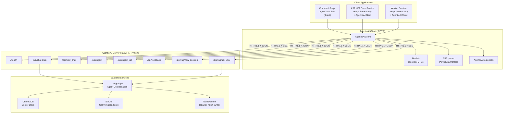
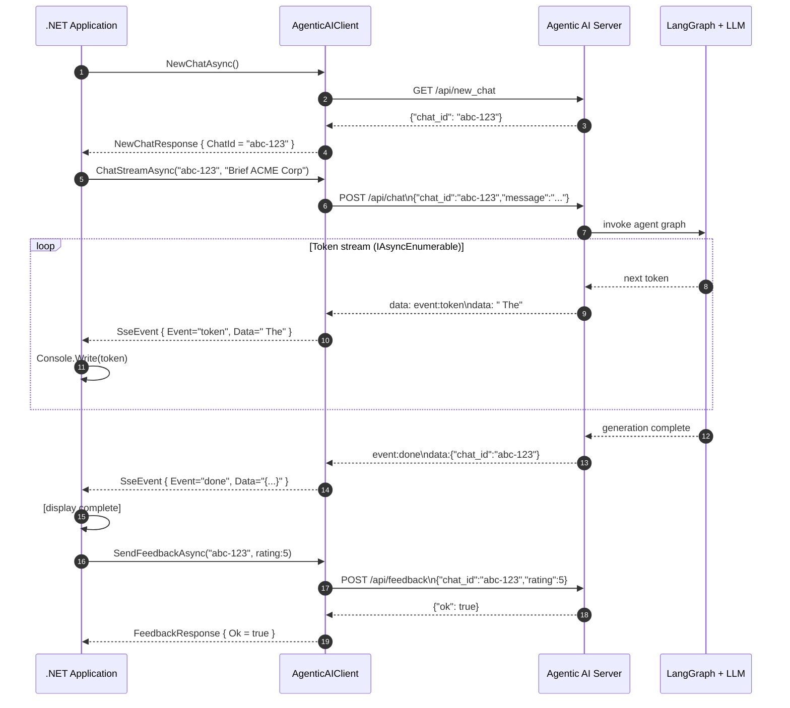

# AgenticAI .NET Client SDK

A production-ready .NET 8 client library for the Agentic AI REST and Server-Sent Events (SSE) API.

[](#)
[](#)
[](#)
[](#)

---

## Table of Contents

- [Architecture overview](#architecture-overview)
- [Client-server sequence diagram](#client-server-sequence-diagram)
- [Installation and setup](#installation-and-setup)
  - [Reference the project directly](#reference-the-project-directly)
  - [Register with IHttpClientFactory (recommended for ASP.NET Core)](#register-with-ihttpclientfactory-recommended-for-aspnet-core)
  - [Direct construction (scripts and console apps)](#direct-construction-scripts-and-console-apps)
- [Configuration options](#configuration-options)
- [API reference and usage examples](#api-reference-and-usage-examples)
  - [Health check](#health-check)
  - [Start a new chat](#start-a-new-chat)
  - [Chat — SSE streaming (token-by-token)](#chat--sse-streaming-token-by-token)
  - [Chat — collect full response](#chat--collect-full-response)
  - [Ingest text](#ingest-text)
  - [Ingest URL](#ingest-url)
  - [Send feedback](#send-feedback)
  - [RAG — new session](#rag--new-session)
  - [RAG ask — SSE streaming](#rag-ask--sse-streaming)
  - [RAG ask — collect full answer](#rag-ask--collect-full-answer)
- [SSE streaming explained](#sse-streaming-explained)
- [Error handling](#error-handling)
- [CancellationToken and timeouts](#cancellationtoken-and-timeouts)
- [Running the examples](#running-the-examples)
- [Project structure](#project-structure)

---

## Architecture overview

The diagram below shows where the .NET client sits within the broader Agentic AI system.



---

## Client-server sequence diagram

This diagram traces a complete chat workflow from the moment the .NET application
calls `NewChatAsync` through to receiving the final `done` SSE event.



---

## Installation and setup

### Reference the project directly

Until the package is published to NuGet, add a project reference from your application:

```xml
<!-- YourApp.csproj -->
<ItemGroup>
  <ProjectReference Include="../path/to/clients/dotnet/AgenticAI.Client.csproj" />
</ItemGroup>
```

### Register with IHttpClientFactory (recommended for ASP.NET Core)

`IHttpClientFactory` handles connection pooling, socket lifetimes, and handler
rotation automatically. This is the preferred pattern for long-running services.

```csharp
// Program.cs
using AgenticAI.Client;

var builder = WebApplication.CreateBuilder(args);

builder.Services.AddHttpClient<AgenticAIClient>(httpClient =>
{
    httpClient.BaseAddress = new Uri(
        builder.Configuration["AgenticAI:BaseUrl"] ?? "http://localhost:8000");
});

// Optional: if you need to pass non-default options alongside IHttpClientFactory
builder.Services.AddSingleton(new AgenticAIClientOptions
{
    StreamTimeout = TimeSpan.FromMinutes(10),
});
```

Then inject the client wherever you need it:

```csharp
public class OutreachService
{
    private readonly AgenticAIClient _ai;

    public OutreachService(AgenticAIClient ai) => _ai = ai;

    public async Task<string> DraftEmailAsync(string company, CancellationToken ct)
    {
        var chat = await _ai.NewChatAsync(ct);
        var (text, _) = await _ai.ChatAsync(
            chat.ChatId,
            $"Draft a short outreach email for {company}.",
            ct: ct);
        return text;
    }
}
```

### Direct construction (scripts and console apps)

```csharp
await using var client = new AgenticAIClient(new AgenticAIClientOptions
{
    BaseUrl       = "http://localhost:8000",
    Timeout       = TimeSpan.FromSeconds(60),
    StreamTimeout = TimeSpan.FromMinutes(5),
});
```

`AgenticAIClient` implements both `IDisposable` and `IAsyncDisposable`. Use
`await using` (or `using`) to ensure the underlying `HttpClient` is released
when the client owns it.

---

## Configuration options

`AgenticAIClientOptions` carries all knobs:

| Property | Type | Default | Description |
|---|---|---|---|
| `BaseUrl` | `string` | `"http://localhost:8000"` | Server root URL. Trailing slashes are stripped automatically. |
| `Timeout` | `TimeSpan` | 60 seconds | Timeout for non-streaming requests (health, new_chat, ingest, feedback). |
| `StreamTimeout` | `TimeSpan` | 5 minutes | Maximum wall-clock time allowed for a single SSE stream. Pass `Timeout.InfiniteTimeSpan` to disable. |

---

## API reference and usage examples

### Health check

```csharp
HealthResponse health = await client.GetHealthAsync();
Console.WriteLine($"Server is {health.Status} (v{health.Version})");
// Server is ok (v0.4.0)
```

Endpoint: `GET /health`
Response model: `HealthResponse { Status, Version }`

---

### Start a new chat

```csharp
NewChatResponse chat = await client.NewChatAsync();
string chatId = chat.ChatId;
// chatId = "3f2a1b9c-..."
```

Endpoint: `GET /api/new_chat`
Response model: `NewChatResponse { ChatId }`

The `chatId` must be passed to subsequent `ChatStreamAsync` / `ChatAsync` calls
to maintain conversation context.

---

### Chat — SSE streaming (token-by-token)

`ChatStreamAsync` returns an `IAsyncEnumerable<SseEvent>` that produces one
object per Server-Sent Event. Enumerate it with `await foreach` to process tokens
as soon as they arrive from the LLM.

```csharp
await foreach (SseEvent evt in client.ChatStreamAsync(chatId, "Brief ACME Robotics"))
{
    switch (evt.Event)
    {
        case "token":
            Console.Write(evt.Data);        // incremental LLM output
            break;
        case "done":
            Console.WriteLine("\n[done]");
            break;
        case "error":
            Console.Error.WriteLine($"[error] {evt.Data}");
            break;
    }
}
```

Endpoint: `POST /api/chat`
Request body: `{ "chat_id": "...", "message": "..." }`
Stream: SSE events with `event: token|done|error`

---

### Chat — collect full response

When you do not need incremental display, use the `ChatAsync` convenience
overload. It reads the entire stream internally and returns the concatenated text.
An optional `onToken` callback lets you still display tokens in real time while
the method collects them.

```csharp
// Without callback — just get the final text.
var (fullText, returnedChatId) = await client.ChatAsync(
    chatId,
    "Summarise Agentic AI in one paragraph.");

Console.WriteLine(fullText);

// With callback — display tokens AND capture full text.
var (text, _) = await client.ChatAsync(
    chatId,
    "List three use-cases for RAG.",
    onToken: token => Console.Write(token));
```

---

### Ingest text

```csharp
IngestResponse result = await client.IngestTextAsync(
    text: "Agentic AI combines planning, tools, and memory.",
    metadata: new Dictionary<string, object?>
    {
        ["source"] = "internal-notes",
        ["tags"]   = "agentic,primer",
    });

Console.WriteLine($"Ingested document id={result.Id}  ok={result.Ok}");
```

Endpoint: `POST /api/ingest`
Request body: `{ "text": "...", "metadata": { ... } }`
Response model: `IngestResponse { Ok, Id }`

---

### Ingest URL

```csharp
IngestResponse result = await client.IngestUrlAsync("https://example.com/whitepaper");
Console.WriteLine($"URL ingested  id={result.Id}");
```

Endpoint: `POST /api/ingest_url`
Request body: `{ "url": "..." }`
Response model: `IngestResponse { Ok, Id }`

---

### Send feedback

```csharp
FeedbackResponse fb = await client.SendFeedbackAsync(
    chatId:  chatId,
    rating:  5,
    comment: "Concise and accurate.");

Console.WriteLine($"Feedback recorded: {fb.Ok}");
```

Endpoint: `POST /api/feedback`
Request body: `{ "chat_id": "...", "rating": 5, "comment": "..." }`
Response model: `FeedbackResponse { Ok }`

The client validates that `rating` is in `[1, 5]` before sending the request and
throws `ArgumentOutOfRangeException` immediately if not.

---

### RAG — new session

```csharp
RagNewSessionResponse session = await client.RagNewSessionAsync();
string sessionId = session.SessionId;
```

Endpoint: `GET /api/rag/new_session`
Response model: `RagNewSessionResponse { SessionId }`

---

### RAG ask — SSE streaming

```csharp
await foreach (SseEvent evt in client.RagAskStreamAsync(sessionId, "What is RAG?"))
{
    if (evt.Event == "token") Console.Write(evt.Data);
    if (evt.Event == "done")  Console.WriteLine("\n[rag done]");
}
```

Endpoint: `POST /api/rag/ask`
Request body: `{ "session_id": "...", "question": "..." }`
Stream: identical SSE format to `/api/chat`

---

### RAG ask — collect full answer

```csharp
string answer = await client.RagAskAsync(
    sessionId,
    "Explain vector embeddings in one paragraph.",
    onToken: t => Console.Write(t));

Console.WriteLine($"\nFull answer: {answer.Length} chars");
```

---

## SSE streaming explained

Server-Sent Events is a standard HTTP/1.1 mechanism for unidirectional streaming
from server to client over a single long-lived `GET` or `POST` connection.

The Agentic AI server emits events in this wire format:

```
event: token
data: Hello

event: token
data: , world

event: done
data: {"chat_id":"abc-123"}

```

Each event block ends with a blank line. The SDK reads the raw response stream
with `HttpCompletionOption.ResponseHeadersRead` (no buffering), parses each block
using `StreamReader.ReadLineAsync`, and yields a `SseEvent` record for every
complete block.

Key implementation details in `AgenticAIClient.StreamSseAsync`:

- The connection uses `SocketsHttpHandler` with keep-alive enabled so repeated
  calls reuse the same TCP connection.
- A `CancellationTokenSource` linked to both the caller's token and
  `StreamTimeout` ensures streams never hang indefinitely.
- `[EnumeratorCancellation]` on the `ct` parameter of the iterator method
  propagates cancellation correctly through `await foreach`.
- Multiple `data:` lines within a single block are joined with `\n` per the SSE
  specification.
- Comment lines (starting with `:`) are silently ignored.

---

## Error handling

All server errors are surfaced as `AgenticAIException`:

```csharp
try
{
    var chat = await client.NewChatAsync();
}
catch (AgenticAIException ex)
{
    Console.Error.WriteLine($"HTTP {ex.StatusCode}: {ex.Message}");
    // ex.ResponseBody contains the raw server error text
}
catch (HttpRequestException ex)
{
    // Network-level failures (DNS, connection refused, etc.)
    Console.Error.WriteLine($"Network error: {ex.Message}");
}
catch (TaskCanceledException ex) when (ex.InnerException is TimeoutException)
{
    // Request exceeded AgenticAIClientOptions.Timeout
    Console.Error.WriteLine("Request timed out.");
}
catch (OperationCanceledException)
{
    // Caller cancelled via CancellationToken
    Console.Error.WriteLine("Request cancelled.");
}
```

Client-side validation (e.g. rating out of range) throws standard BCL exceptions
before any network call is made:

```csharp
try
{
    await client.SendFeedbackAsync(chatId, rating: 0);  // invalid
}
catch (ArgumentOutOfRangeException ex)
{
    Console.WriteLine(ex.Message);
    // Rating must be between 1 and 5.
}
```

---

## CancellationToken and timeouts

Every public method accepts an optional `CancellationToken`. Pass one to support
graceful cancellation in web requests, background services, or interactive CLIs:

```csharp
// Abort the stream if the user presses Ctrl+C.
using var cts = new CancellationTokenSource();
Console.CancelKeyPress += (_, e) => { e.Cancel = true; cts.Cancel(); };

try
{
    await foreach (var evt in client.ChatStreamAsync(chatId, prompt, cts.Token))
    {
        if (evt.Event == "token") Console.Write(evt.Data);
    }
}
catch (OperationCanceledException)
{
    Console.WriteLine("\n[cancelled by user]");
}
```

For time-bounded operations use `CancellationTokenSource(TimeSpan)`:

```csharp
using var cts = new CancellationTokenSource(TimeSpan.FromSeconds(30));
var health = await client.GetHealthAsync(cts.Token);
```

The `StreamTimeout` option in `AgenticAIClientOptions` sets a per-stream ceiling
that applies independently of the caller's token, protecting against streams that
stall without emitting data.

---

## Running the examples

Make sure the Agentic AI server is running (`make run` or `docker compose up`
from the repository root), then:

```bash
cd clients/dotnet/Examples
dotnet run
```

To point at a different server address:

```bash
dotnet run -- --base-url http://my-server:8000
```

The example console app walks through every endpoint in sequence and prints
annotated output so you can follow the request/response flow.

---

## Project structure

```
clients/dotnet/
├── AgenticAI.Client.csproj   # .NET 8 class library — the SDK
├── AgenticAIClient.cs        # Main client class (HttpClient, SSE parser)
├── Models.cs                 # Request/response records + AgenticAIException
├── README.md                 # This file
└── Examples/
    ├── Examples.csproj       # Console app project
    └── Program.cs            # Runnable demo covering every endpoint
```

| File | Responsibility |
|---|---|
| `AgenticAIClient.cs` | All API methods, SSE `IAsyncEnumerable` streaming, `HttpClient` lifecycle, shared HTTP helpers |
| `Models.cs` | Strongly typed request/response records, `AgenticAIException` |
| `Examples/Program.cs` | End-to-end usage walkthrough with both direct construction and `IHttpClientFactory` patterns |
