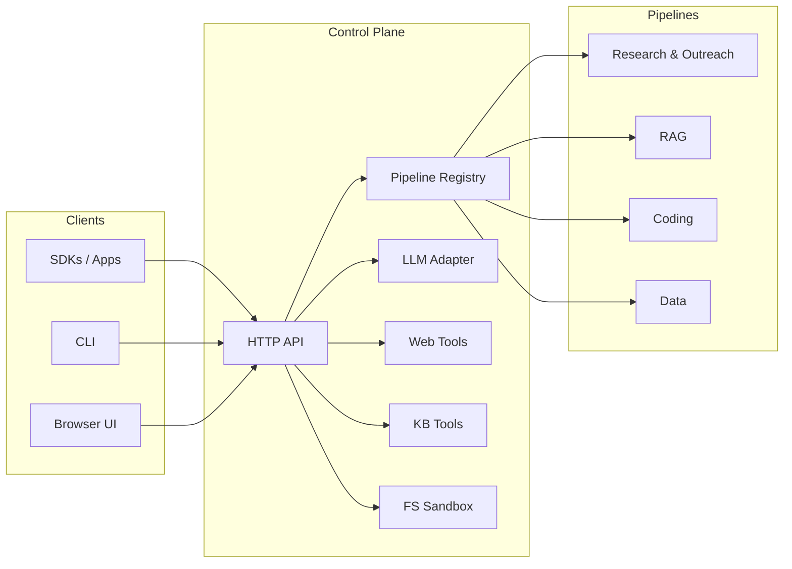
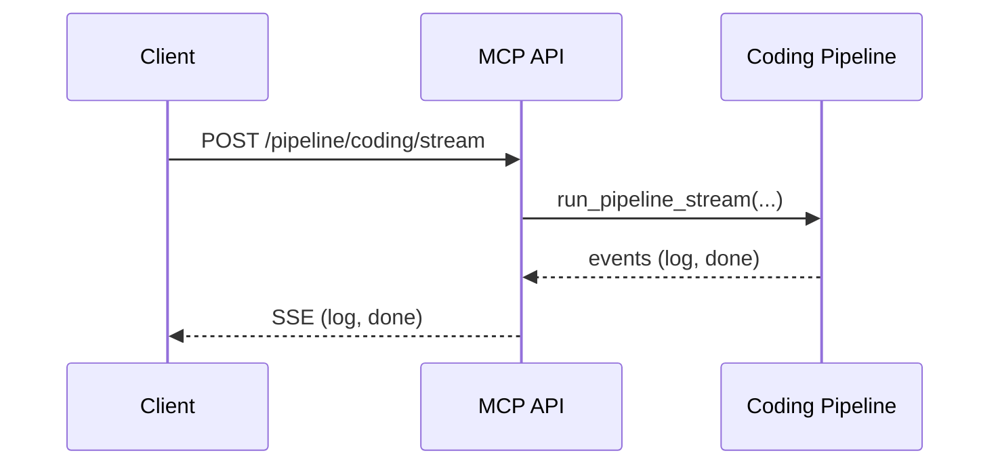
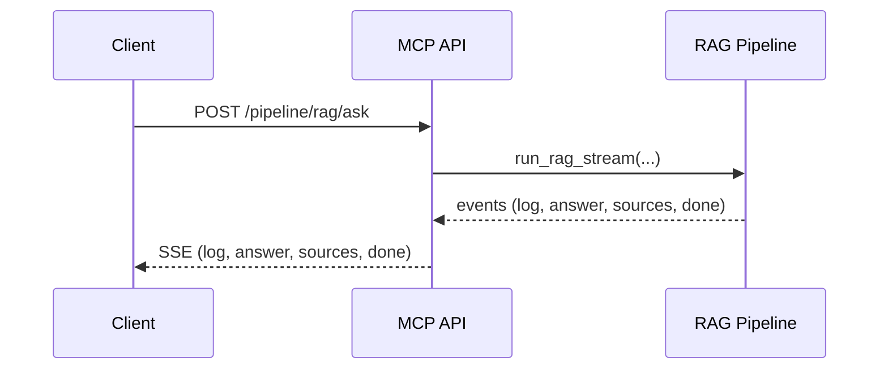

# MCP Server (Monorepo Control Plane)

[](#)
[](#)
[](#)
[](#)
[](#)
[](#)
[](#)
[](#)
[](#)
[](#)

A shared control plane exposing common tools and pipeline dispatch over HTTP, so all agentic subsystems (Research/Outreach agent, Agentic‑RAG, Agentic‑Coding) reuse the same toolbox and can be orchestrated from one place.

## Contents

- [What You Get](#what-you-get)
- [Architecture](#architecture)
- [Quick Start](#quick-start)
- [Endpoints](#endpoints)
- [Examples](#examples)
- [Security & Limits](#security--limits)
- [Project Structure](#project-structure)

## What You Get

- Pipeline dispatch
  - Register ad‑hoc handlers via `/pipeline/{name}`
  - Stream adapters for: Coding (`/pipeline/coding/stream`) and RAG (`/pipeline/rag/ask`)
- LLM utilities
  - `/llm/{provider}` (OpenAI, Claude, Gemini)
  - `/llm/summarize` for short summaries
- Web tools
  - `/search` (DuckDuckGo), `/browse` (fetch + extract), `/research` (search + fetch top results)
- KB tools (root Chroma‑backed KB)
  - `/kb/add` and `/kb/search`
- File sandbox
  - `/fs/write` and `/fs/read` under `data/agent_output`

## Architecture



### Sequence Examples





## Quick Start

Run in‑process for quick checks:

```bash
python - <<'PY'
from mcp import MCPServer
from fastapi.testclient import TestClient
srv = MCPServer(); client = TestClient(srv.app)
print(client.get('/status').json())
PY
```

Serve as an ASGI app:

```bash
uvicorn mcp.server:create_app --factory --reload
# Then:  http://127.0.0.1:8000/pipelines
```

## Endpoints

- Pipelines
  - POST `/pipeline/{name}` — call a registered handler `{ task }`
  - GET  `/pipelines` — list available names
  - POST `/pipeline/coding/stream` — stream logs/results (SSE)
  - POST `/pipeline/rag/ask` — stream answer/sources (SSE)
- LLM
  - POST `/llm/{provider}` — `{ prompt, model? }`
  - POST `/llm/summarize` — `{ text, provider?, model? }`
- Web
  - GET `/search?q=&max_results=`
  - GET `/browse?url=`
  - GET `/research?q=&max_results=`
- KB
  - POST `/kb/add` — `{ id?, text, metadata? }`
  - GET `/kb/search?q=&k=`
- Files (sandboxed)
  - POST `/fs/write` — `{ path, content }`
  - GET `/fs/read?path=`

## Examples

Register an in‑process pipeline and call it:

```python
from mcp import MCPServer
from fastapi.testclient import TestClient

srv = MCPServer()
srv.register("echo", lambda task: {"echo": task})
client = TestClient(srv.app)
print(client.post("/pipeline/echo", json={"task": "hi"}).json())
```

SSE adapter (Coding):

```bash
curl -N -X POST http://127.0.0.1:8000/pipeline/coding/stream \
  -H 'Content-Type: application/json' \
  -d '{"repo": "/path/to/repo", "task": "Add pagination"}'
```

SSE adapter (RAG):

```bash
curl -N -X POST http://127.0.0.1:8000/pipeline/rag/ask \
  -H 'Content-Type: application/json' \
  -d '{"question": "Summarize topic X"}'
```

Web + KB + FS:

```bash
curl 'http://127.0.0.1:8000/search?q=python&max_results=2'
curl 'http://127.0.0.1:8000/browse?url=https://example.com'
curl -X POST 'http://127.0.0.1:8000/kb/add' -H 'Content-Type: application/json' \
     -d '{"text":"notes","metadata":{"tags":["kb"]}}'
curl 'http://127.0.0.1:8000/kb/search?q=notes&k=2'
curl -X POST 'http://127.0.0.1:8000/fs/write' -H 'Content-Type: application/json' \
     -d '{"path":"demo/out.txt","content":"hello"}'
curl 'http://127.0.0.1:8000/fs/read?path=demo/out.txt'
```

## Security & Limits

- FS operations are sandboxed to `data/agent_output`.
- Network calls (search/fetch) are best‑effort and may be rate‑limited by upstreams.
- LLM providers require respective API keys to be configured in the environment.

## Project Structure

```
mcp/
  README.md        # This guide
  __init__.py      # Entry (MCPServer)
  server.py        # FastAPI app + endpoints
  schemas.py       # Pydantic request models
  tools/
    web.py         # search/fetch helpers
    kb.py          # KB add/search (Chroma-backed via root project)
    files.py       # Safe read/write under data/agent_output
```

## Requirements

- Python 3.10+
- Dependencies are in the repo root `requirements.txt` (FastAPI, httpx, trafilatura, bs4, duckduckgo-search, etc.).
- LLM provider keys as needed for `/llm/*` endpoints:
  - `OPENAI_API_KEY`, `ANTHROPIC_API_KEY`, `GOOGLE_API_KEY`

## Install & Run

```bash
python -m venv .venv
. .venv/bin/activate
pip install -U pip
pip install -r requirements.txt

# Run MCP as ASGI app
uvicorn mcp.server:create_app --factory --host 0.0.0.0 --port 8080 --reload

# Explore
curl -s http://127.0.0.1:8080/pipelines | jq .
```

To run inside the existing Docker image (which defaults to the root research server), override the command:

```bash
docker build -t agentic-ai .
docker run -p 8080:8080 --rm \
  -e OPENAI_API_KEY=sk-... \
  agentic-ai \
  python -m uvicorn mcp.server:create_app --factory --host 0.0.0.0 --port 8080
```

## SDK Examples

TypeScript (Node 18+):

```ts
import { AgenticAIClient } from "../clients/ts/src/client";
const c = new AgenticAIClient({ baseUrl: "http://127.0.0.1:8080" });

// LLM
const sum = await fetch(`${c["base"]}/llm/summarize`, { method: 'POST', headers: {'Content-Type':'application/json'}, body: JSON.stringify({ text: 'Long text here', provider: 'openai' })}).then(r=>r.json());

// Coding pipeline (SSE)
await c.codingStream({ repo: "/path/to/repo", task: "Add pagination", onEvent: ev => console.log(ev.event, ev.data) });

// RAG pipeline (SSE)
await c.ragAskStream({ question: "Summarize\n this topic", onEvent: ev => console.log(ev.event, ev.data) });
```

Python (async):

```python
import anyio, httpx

async def main():
    async with httpx.AsyncClient(base_url="http://127.0.0.1:8080", timeout=60.0) as client:
        # LLM summarize
        r = await client.post("/llm/summarize", json={"text":"Long text...","provider":"openai"})
        print(r.json())

        # Coding stream
        r = await client.post("/pipeline/coding/stream", json={"repo": "/repo", "task": "Implement X"})
        async for chunk in r.aiter_text():
            for block in chunk.split("\n\n"):
                if not block.strip(): continue
                ev = next((ln[6:].strip() for ln in block.splitlines() if ln.startswith("event:")), None)
                data = next((ln[5:] for ln in block.splitlines() if ln.startswith("data:")), None)
                if ev and data: print(ev, data)

anyio.run(main)
```

## Error Handling & Codes

- `404` — unknown pipeline (`/pipeline/{name}` not registered)
- `400` — invalid arguments (e.g., missing `question`, unknown LLM provider)
- `500` — upstream provider/tool failures (network, parsing)

Responses are always JSON (or SSE blocks with `event:` + `data:`), with clear `detail` on error.

## Extending MCP

- Add a new tool
  - Create a module under `mcp/tools/<name>.py` with small, testable functions.
  - Mount endpoints in `mcp/server.py` (keep input/output JSON minimal and consistent).
- Register a pipeline
  - In-process: `srv.register("my_pipeline", lambda task: {...})`.
  - For monorepo pipelines, import their service module on-demand like existing adapters (Coding/RAG/Data) and expose an SSE endpoint.
- Keep endpoints fast: perform network calls with reasonable timeouts and handle exceptions gracefully.

## Observability & Security

- Put an API gateway/reverse proxy in front to terminate TLS and add auth.
- Add request IDs and structured logging at the proxy or in this app (if desired).
- Filesystem writes are sandboxed to `data/agent_output` to avoid accidental writes elsewhere.
- Rate limiting is recommended at the proxy layer for `/llm/*` and streaming endpoints.
